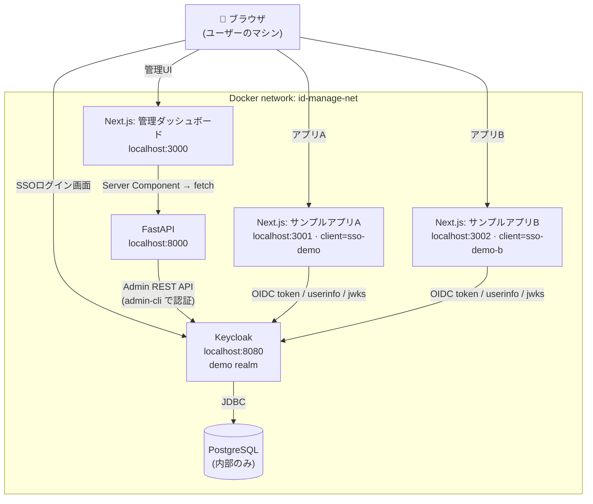
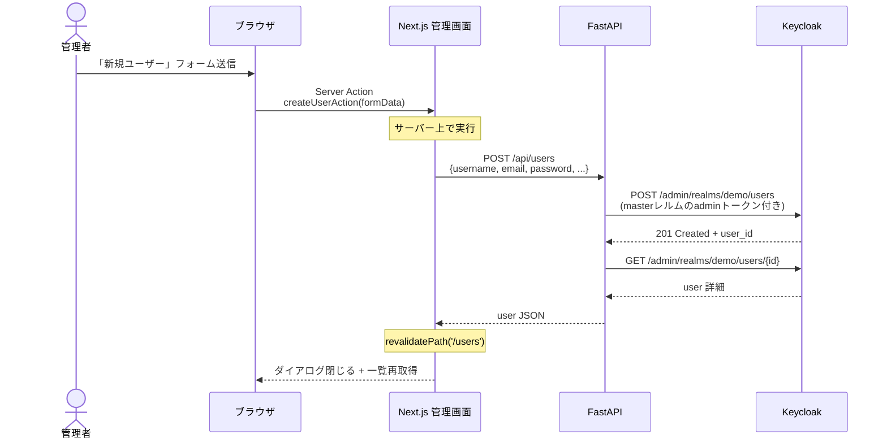
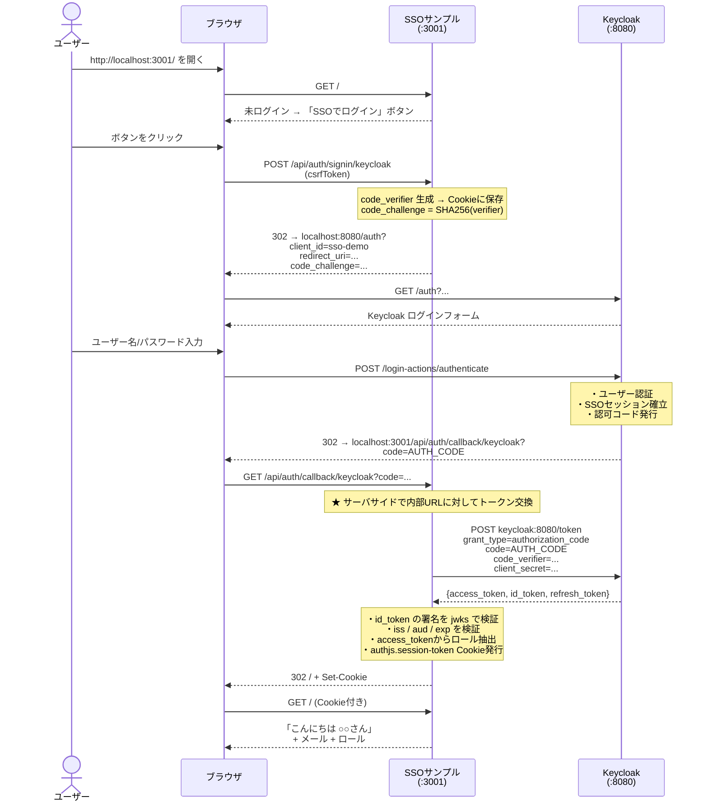
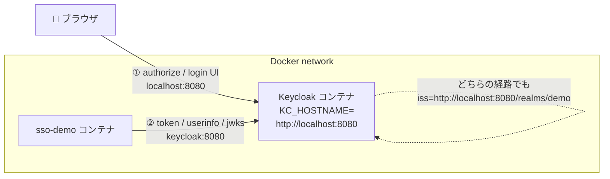
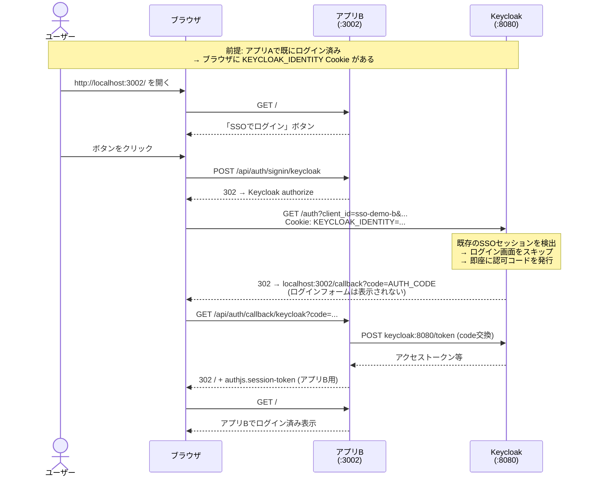
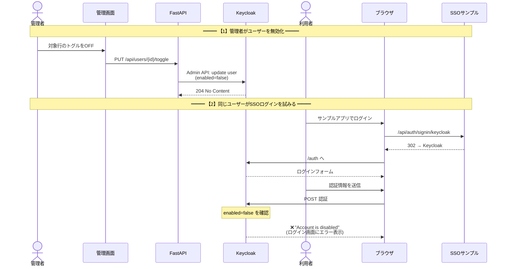

# アーキテクチャ / 動作解説

このドキュメントは、`id_manage` デモアプリのシステム構成と、**どうやってシングルサインオン（SSO）が実現されているか** を説明します。

## 1. 全体像

6つのコンテナで構成され、すべて Docker Compose のプライベートネットワーク `id-manage-net` 上で動きます。ユーザーのブラウザだけがネットワークの外から `localhost:xxxx` 経由で各サービスに接続します。



AppA と AppB は **別のクライアント**ですが、**同じ `demo` レルムを共有** しているので、片方でログインするだけでもう片方も自動的にログイン済みになります（詳細はセクション 6）。

## 2. コンポーネントの役割

| コンポーネント | 役割 | 主要技術 |
| --- | --- | --- |
| **PostgreSQL** | KeycloakのデータストアDB | `postgres:16-alpine` |
| **Keycloak** | IDプロバイダ（ユーザー・レルム・ロール・セッション・OIDC発行元） | Keycloak 最新版（Quarkus） |
| **FastAPI** | Keycloak Admin REST API のラッパー。管理UIから呼ぶ業務APIを薄く整理 | Python / `python-keycloak` / `pydantic-settings` |
| **Next.js 管理ダッシュボード** | 管理者向けUI。ユーザーCRUD、ロール割り当て、セッション/イベント閲覧 | App Router / Server Components / Server Actions / shadcn/ui |
| **Next.js SSOサンプルアプリ A** (`:3001`) | デモクライアント A（sienna アクセント、client: `sso-demo`） | next-auth v5 / Keycloak OIDC |
| **Next.js SSOサンプルアプリ B** (`:3002`) | デモクライアント B（forest アクセント、client: `sso-demo-b`）。Aと同じレルムを共有しSSOクロスログインを体験 | next-auth v5 / Keycloak OIDC |

この構成の特徴は、**「管理機能のフロー」と「SSO認証のフロー」が完全に別経路** である点です。

- 管理機能: `管理UI → FastAPI → Keycloak Admin REST API`（admin権限で叩く）
- SSO認証: `ブラウザ → Keycloakログイン画面 → サンプルアプリのコールバック`（ユーザー権限で叩く）

## 3. 管理機能の流れ

管理画面からユーザーを作成すると、以下のような経路で Keycloak にユーザーが作られます。



ポイント：

- 読み取り（一覧、詳細、ロール、セッション、イベント）はすべて **Next.js の Server Component** から Docker内部の `http://fastapi:8000` を叩いています。ブラウザから直接 FastAPI は見えません。
- 書き込み（作成・トグル・ロール付与/剥奪）は **Server Action** で、成功時に `revalidatePath()` でキャッシュを破棄します。
- FastAPI は python-keycloak の `KeycloakAdmin` で `master` レルムの管理者として Keycloak に認証し、そのトークンで `demo` レルムを操作します。

## 4. SSOの仕組み（Authorization Code + PKCE）

サンプルアプリ（`:3001`）のログインは、標準的な OpenID Connect の **Authorization Code フロー + PKCE** で実装されています。



### ここで使われている OIDC の部品

| 部品 | 役割 |
| --- | --- |
| **Authorization Endpoint** (`/auth`) | ブラウザをKeycloakに連れて行き、ユーザーが認証される場所 |
| **Token Endpoint** (`/token`) | サンプルアプリ（サーバ）が認可コードをトークンに交換する場所 |
| **UserInfo / JWKS** | 必要に応じてユーザー情報取得や署名鍵の取得に使う |
| **PKCE (`code_verifier` / `code_challenge`)** | 認可コードの横取り対策。ブラウザで生成した verifier を最後の交換で一緒に送る |
| **`id_token`** | ユーザー情報が入った JWT。`iss` `sub` `email` `preferred_username` などを含む |
| **`access_token`** | API呼び出し用トークン。Keycloakでは `realm_access.roles` にロールが入る |
| **`authjs.session-token` Cookie** | サンプルアプリ側のセッション識別子（next-auth が発行） |

### サンプルアプリ側のコード（抜粋）

サンプルアプリ（`sso-demo/auth.ts`）では、**認可エンドポイントとトークンエンドポイントのURLを使い分け** ています。

```ts
Keycloak({
  clientId: "sso-demo",
  clientSecret: "...",
  issuer: "http://localhost:8080/realms/demo",  // iss 検証用

  // ブラウザが叩く → 外部URL
  authorization: {
    url: "http://localhost:8080/realms/demo/protocol/openid-connect/auth",
    params: { scope: "openid profile email" },
  },

  // コンテナ内部から叩く → 内部URL
  token:          "http://keycloak:8080/realms/demo/protocol/openid-connect/token",
  userinfo:       "http://keycloak:8080/realms/demo/protocol/openid-connect/userinfo",
  jwks_endpoint:  "http://keycloak:8080/realms/demo/protocol/openid-connect/certs",
})
```

## 5. Docker構成ゆえの罠：「Keycloakのホスト名問題」

上で "外部URL" と "内部URL" を分けているのには理由があります。Docker内でIDプロバイダを動かすと必ず遭遇する古典的な問題です。

### 問題

- ブラウザからは `http://localhost:8080` で到達する
- SSOサンプルアプリのコンテナからは `http://keycloak:8080` で到達する
- Keycloakが発行するトークンの `iss` クレームはどちらか片方しか持てない
- 「ブラウザが開く URL」と「コンテナが叩く URL」と「`iss` が一致すべき URL」が揃わないと、次のいずれかで失敗する
  - `redirect_uri mismatch`
  - `iss claim mismatch`
  - トークン交換時にKeycloakに到達できない

### 解決策



1. **Keycloak側**: 環境変数 `KC_HOSTNAME=http://localhost:8080` を設定。これにより、どのホスト名でリクエストを受けても、常に `iss=http://localhost:8080/realms/demo` を発行する。
2. **next-auth側**: `authorization` は `localhost:8080`（ブラウザが開く）、`token` / `userinfo` / `jwks_endpoint` は `keycloak:8080`（コンテナから叩く）に分離。
3. **`issuer` の検証**: サンプルアプリは `iss === http://localhost:8080/realms/demo` を期待。KeycloakがKC_HOSTNAMEで固定したiss値と一致するのでOK。

この仕組みにより、`localhost:8080` という同じ `iss` を、どの経路でも一貫して維持できます。

## 6. SSOの真価：アプリ間の自動ログイン

アプリ A（`:3001`）とアプリ B（`:3002`）は、どちらも同じ `demo` レルムを共有する別クライアント（`sso-demo` / `sso-demo-b`）です。同じレルムを使っているので、**片方にログインするだけでもう片方も自動的にログイン済み状態になります**。これがSSO (Single Sign-On) の本来の利点です。

### 仕組み

認証済みCookieには3種類あって、それぞれスコープが異なります：

| Cookie | 持ち主 | スコープ | 消すとどうなる |
| --- | --- | --- | --- |
| `authjs.session-token` (アプリA用) | `:3001` のNext.js | `http://localhost:3001` | アプリA のセッション終了。他は影響なし |
| `authjs.session-token` (アプリB用) | `:3002` のNext.js | `http://localhost:3002` | アプリB のセッション終了。他は影響なし |
| `KEYCLOAK_IDENTITY` / `KEYCLOAK_SESSION` | Keycloak | `http://localhost:8080` | **SSO自体が終了** → 次回はログイン画面 |

「アプリBで自動ログインが効く」の正体は、ブラウザに残っている **`KEYCLOAK_IDENTITY` Cookie** が認可エンドポイントに送られるためです。

### アプリBに遷移したときの通信



実測結果（curlでE2E検証）：

| シナリオ | ログインフォーム | 結果 |
| --- | --- | --- |
| Keycloak Cookieなしでアプリアクセス | 表示される | 通常のログイン |
| アプリAでログイン後、アプリBにアクセス | **表示されない** | 自動ログイン成功 |
| アプリBでログイン後、アプリAにアクセス | **表示されない** | 自動ログイン成功 |
| 「SSOからも完全にログアウト」後の再訪問 | 表示される | 通常のログイン |

### ログアウトが2種類ある理由

SSO環境では「ログアウト」の粒度を使い分けできる必要があります。両サンプルアプリでは以下の2つを別操作として用意しています：

- **「このアプリからログアウト」** — そのアプリの `authjs.session-token` Cookie だけを消す。Keycloak側のSSOセッションは残るため、もう一方のアプリでは引き続きログイン済み。
- **「SSOからも完全にログアウト」** — Keycloak の `end_session` エンドポイントに `id_token_hint` 付きで飛ばす。Keycloak側の `KEYCLOAK_IDENTITY` Cookie が無効化され、全てのアプリで再認証が必要になる。

現実のサービスではログアウトボタンを押したときにどちらを行うべきか（共有PCでは後者、個人PCでは前者でいい等）で設計判断が分かれます。

## 7. ユーザー無効化シナリオ

「管理画面で無効化されたユーザーはSSOログインできない」ことを示すシナリオの内部動作：



重要なのは、**サンプルアプリ側では特別な実装は一切不要** である点です。ユーザーの有効/無効判定はKeycloakの責務で、認証フェーズで弾かれるためコードはそこに到達しません。これがIDプロバイダに認証を集約する (SSO化する) 大きな利点のひとつです。

## 8. セキュリティに関する補足

このプロジェクトは **デモ用途** であり、本番運用ではありません。以下は実環境で必ず変えるべきポイントです：

| 項目 | デモ値 | 本番での対応 |
| --- | --- | --- |
| Keycloak admin パスワード | `admin / admin` | 強固なパスワード + MFA |
| `sso-demo` クライアント secret | `sso-demo-secret-please-change` | 環境変数/シークレットマネージャ経由 |
| `sso-demo-b` クライアント secret | `sso-demo-b-secret-please-change` | 同上 |
| `AUTH_SECRET` (next-auth) | 固定文字列（A/B で別の値を使用） | ランダム生成して環境変数で注入 |
| Keycloakの公開URL | `http://localhost:8080` (HTTP) | HTTPS + 正式なドメイン + `KC_HOSTNAME` を本番URLに |
| `sslRequired` (demoレルム) | `external` | `all` （内部含め全てHTTPS必須） |
| ブルートフォース保護 | 有効 (既定) | 引き続き有効、加えてWAF/レート制限 |

## 9. 参考リンク

- [Keycloak Server Administration Guide — Configuring the Hostname](https://www.keycloak.org/server/hostname)
- [Keycloak — Importing and exporting realms](https://www.keycloak.org/server/importExport)
- [Auth.js (next-auth v5) — Keycloak Provider](https://authjs.dev/getting-started/providers/keycloak)
- [OpenID Connect Core 1.0 — Authentication using the Authorization Code Flow](https://openid.net/specs/openid-connect-core-1_0.html#CodeFlowAuth)
- [RFC 7636 — Proof Key for Code Exchange (PKCE)](https://datatracker.ietf.org/doc/html/rfc7636)
