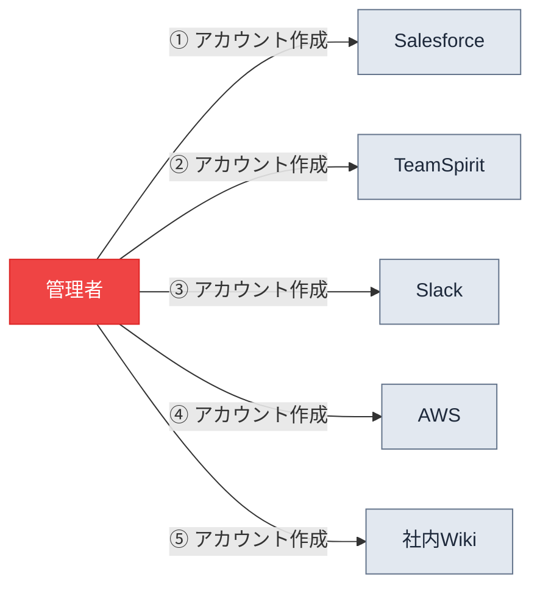
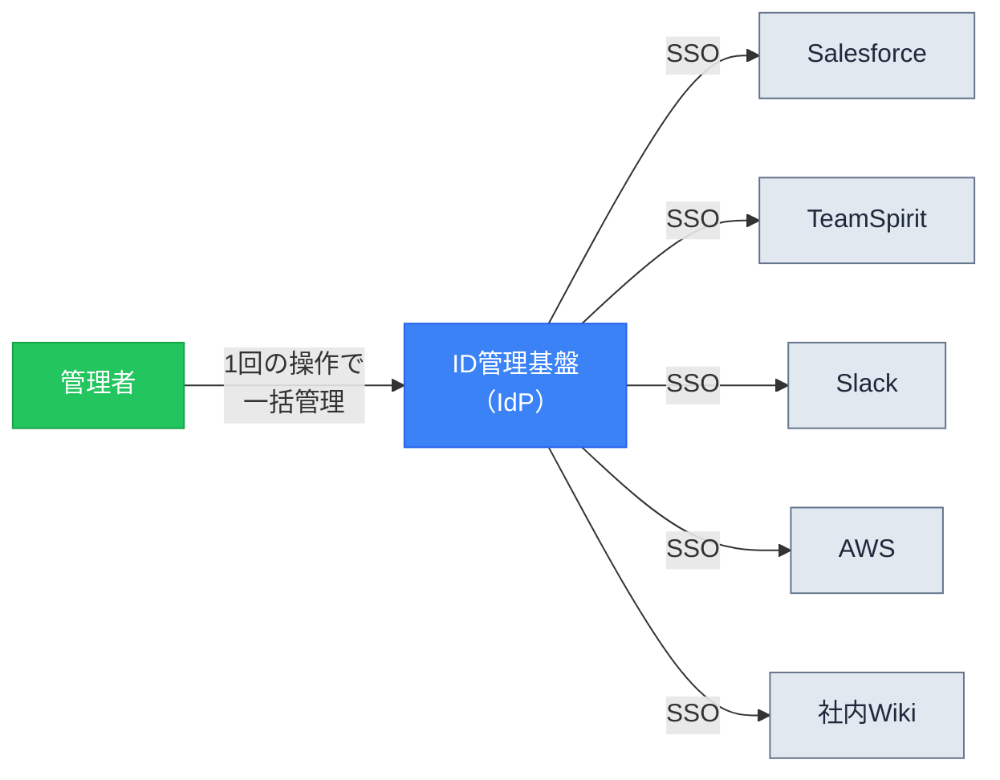
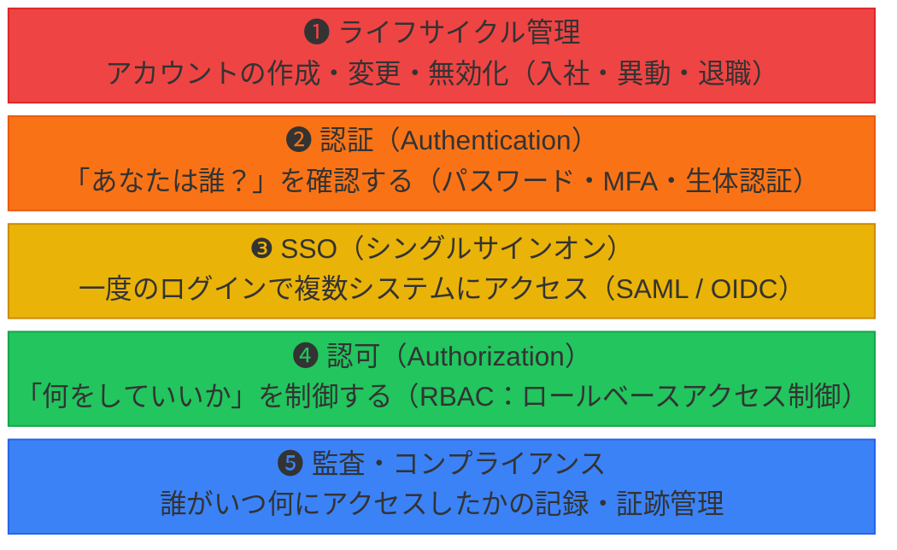
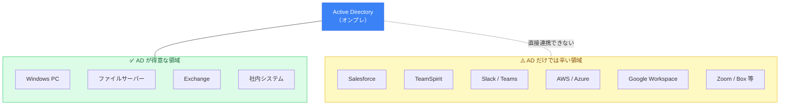
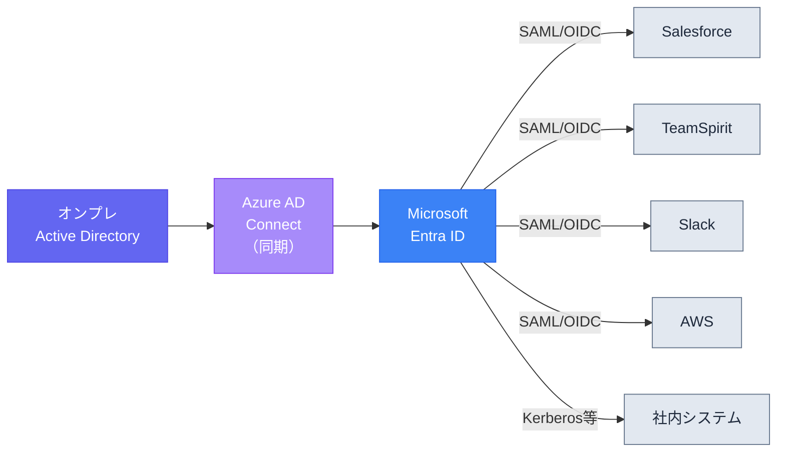
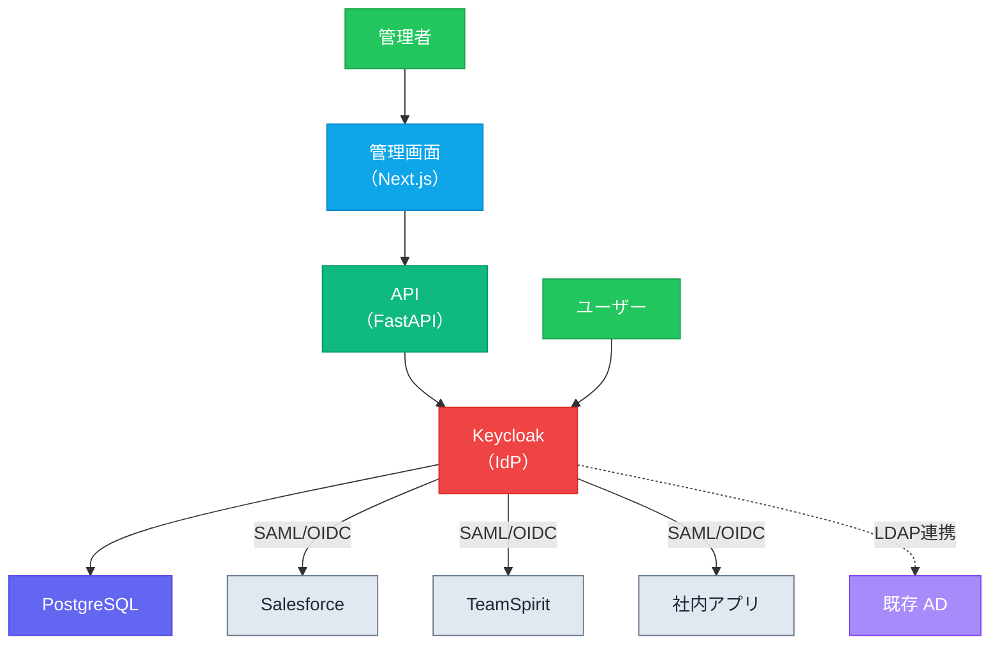
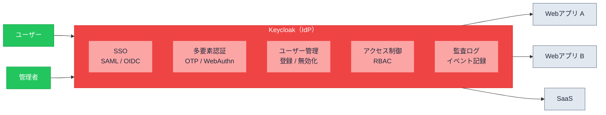
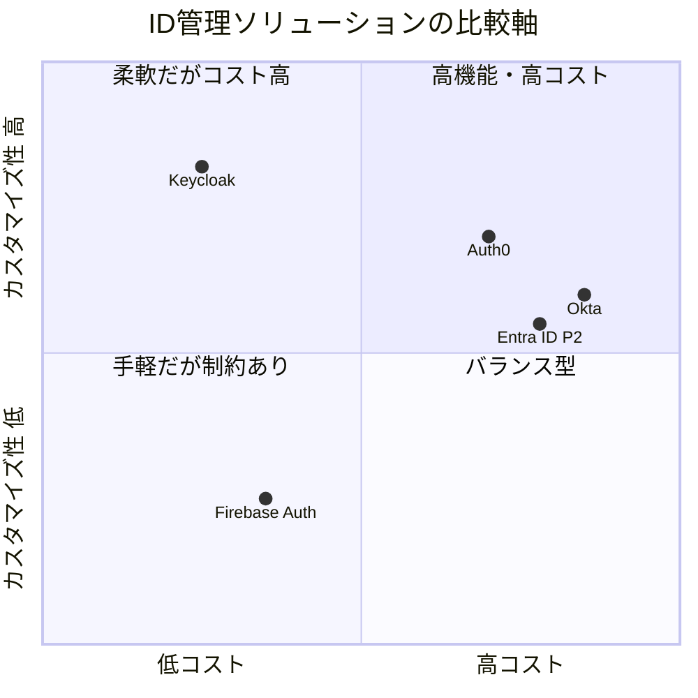
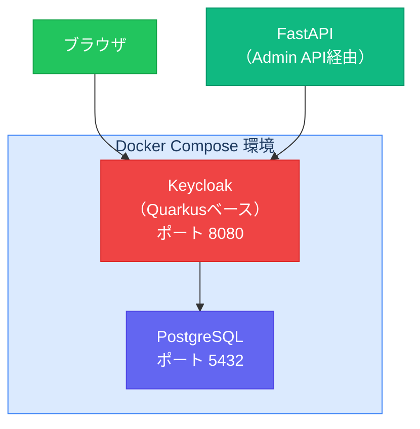
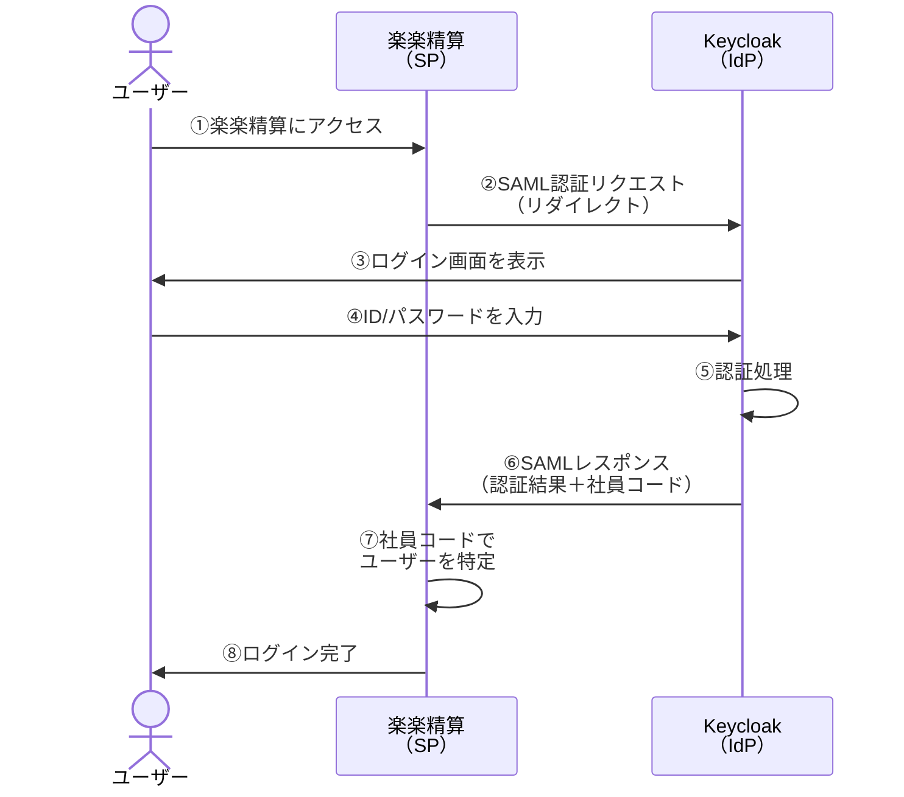

# ID管理（Identity Management）概要

## 1. ID管理とは何か

ID管理とは、**「組織内の人の出入りとシステムへのアクセス権を一箇所で安全に制御する」** 仕組みのことです。

会社で利用するシステムが増えるほど、「誰が」「どのシステムに」「どんな権限で」アクセスできるかの管理が複雑になります。ID管理はこの複雑さを解消し、セキュリティと運用効率の両方を向上させます。

---

## 2. ID管理が解決する問題

### ID管理がない世界



- 社員が入社するたびに、各システムに**個別にアカウントを作成**する必要がある
- 退職時は各システムを**手動で一つずつ無効化** → 漏れがあるとセキュリティ事故に
- ユーザーはシステムごとに**別々のID/パスワードを管理**する必要がある
- 「誰がどのシステムにアクセスできるか」の**全体像が見えない**

### ID管理がある世界



- 管理者は **IdP の1アカウントを管理するだけ** で全システムに反映
- 退職時は **1操作で全システムのアクセスを即時遮断**
- ユーザーは **1回のログインで全システムを利用可能**（SSO）
- 「誰が何にアクセスできるか」を **一覧で把握** できる

---

## 3. ID管理の5つの機能層

ID管理は以下の5つの層で構成されます。



### 各層の詳細

| 層 | 名称 | 説明 | 具体例 |
|---|---|---|---|
| ❶ | ライフサイクル管理 | 人の出入りに連動してアカウントを管理 | 入社→アカウント作成、異動→権限変更、退職→無効化 |
| ❷ | 認証 | 本人確認 | パスワード、多要素認証（MFA）、生体認証 |
| ❸ | SSO | 一度の認証で複数システムを利用 | SAML 2.0 / OpenID Connect による連携 |
| ❹ | 認可 | アクセス可能な範囲を制御 | 「営業部 → Salesforce利用可」「一般社員 → 管理画面アクセス不可」 |
| ❺ | 監査 | アクセス履歴と権限変更の記録 | ログイン履歴、権限変更ログ、ISMS対応の証跡 |

### 特に重要な2つの層

**❶ ライフサイクル管理** は最も泥臭く、かつ最も重要です。「異動したのにアクセス権が前の部署のまま」「退職したのにアカウントが残っている」という問題は現実に頻発しており、これを自動化・一元管理することがID管理の核心的な価値です。

**❺ 監査** は企業規模が大きくなるほど必須になります。セキュリティ監査やISMS対応で「誰がいつどこにアクセスしたか提示してください」と求められた際に、ログが一元管理されていないと対応できません。

---

## 4. Active Directory だけではなぜダメなのか？

### AD が得意な領域

Active Directory（AD）は、Microsoftが提供するオンプレミス環境向けのID管理基盤です。以下の領域では非常に強力です。

- Windows PCのドメインログオン管理
- ファイルサーバーのアクセス制御
- Exchange（メール）との連携
- グループポリシーによる端末制御

**オンプレのWindowsベースのシステムだけで完結している会社であれば、ADだけで十分にカバーできます。**

### AD だけでは辛くなるケース

近年はSaaS（クラウドサービス）の利用が急増しており、ADだけではカバーしきれない領域が生まれています。



SaaSとADを直接連携できないため、SaaSごとに個別のID/パスワード管理に逆戻りしてしまいます。

### 解決策：Azure AD（Entra ID）との連携

Microsoftはこの課題に対して、ADのクラウド拡張版である **Azure AD（現 Microsoft Entra ID）** を提供しています。



この構成により、**オンプレADのアカウント情報を源泉としながら、クラウドサービスへのSSO連携** を実現できます。

---

## 5. 自前のID管理アプリが活きるケース

Entra ID + 各SaaSの標準SSO連携で済む会社であれば、自作は不要です。
自前のID管理アプリが価値を持つのは以下のようなケースです。

| ケース | 説明 |
|---|---|
| Entra ID のコストを抑えたい | Entra ID P1/P2 ライセンスはユーザー単価が高い。Keycloak（OSS）なら無料 |
| Entra ID に対応しない社内システムがある | 独自開発の社内アプリや古いシステムとの連携が必要 |
| 管理画面を自社運用に最適化したい | 権限一覧の可視化、承認フロー、独自のレポートなど |
| マルチIdP構成が必要 | AD + Google Workspace など複数の認証基盤を束ねたい |

### 自前構築の構成例（Keycloak ベース）



この構成では、Keycloakが認証プロトコル（SAML/OIDC）の処理を担い、FastAPI + Next.js で独自の管理ダッシュボードを構築します。既存のADがある場合は、KeycloakのLDAP連携機能でユーザー情報を同期できます。

---

## 6. Keycloak とは

### 概要

Keycloak（キークローク）は、Red Hat社が開発を主導するオープンソースの **IAM（Identity and Access Management）** ソフトウェアです。2014年にバージョン1.0.0がリリースされ、Apacheライセンス 2.0で公開されています。

一言でいえば、**「アプリケーション開発者が認証・認可の仕組みを一から作らなくて済むようにする」** ためのソフトウェアです。Keycloakを導入すれば、SSO・多要素認証・ユーザー管理・アクセス制御といった機能を、コードをほとんど書かずに利用できます。



### 主な機能

| 機能 | 説明 |
|---|---|
| **シングルサインオン（SSO）** | SAML 2.0 / OpenID Connect / OAuth 2.0 に対応。一度の認証で複数のアプリケーションを利用可能 |
| **多要素認証（MFA）** | ワンタイムパスワード（OTP）、WebAuthn（生体認証・パスキー）に対応し、パスワードだけに頼らない認証を実現 |
| **ユーザー管理** | ユーザーの登録・プロファイル管理・グループ管理を管理コンソールから操作可能。ユーザー自身によるパスワードリセットやアカウント管理も可能 |
| **ロールベースアクセス制御（RBAC）** | ユーザーやグループにロールを割り当て、アプリケーションごとのアクセス権限をきめ細かく制御 |
| **外部IdP連携** | Active Directory / LDAP との連携に対応。既存のユーザーデータベースをそのまま活用可能 |
| **ソーシャルログイン** | Google、Facebook、GitHub 等のアカウントを使ったログインを管理コンソールの設定だけで実現 |
| **監査ログ** | ログインイベント（ログイン・ログアウト・パスワード変更等）と管理イベント（管理コンソール上の操作）を記録・閲覧可能 |
| **マルチテナント** | 「レルム」という単位で設定を分離でき、複数の組織やプロジェクトを1つのKeycloakインスタンスで管理可能 |
| **REST API** | すべての機能をREST API経由で操作可能。外部システムとの連携やカスタム管理画面の構築が容易 |

### なぜ Keycloak を選ぶのか

ID管理・SSO基盤の選択肢は他にもあります。Keycloakのポジションを整理すると以下のようになります。



| ソリューション | 種別 | コスト | 特徴 |
|---|---|---|---|
| **Keycloak** | OSS / セルフホスト | 無料（インフラ費のみ） | 高いカスタマイズ性、REST APIで全機能操作可能、AD/LDAP連携が容易。運用は自前で行う必要がある |
| **Microsoft Entra ID** | クラウドサービス | P1: 約¥900/ユーザー/月、P2: 約¥1,350/ユーザー/月 | Microsoft製品との親和性が最高。条件付きアクセスや自動プロビジョニングなど高度な機能 |
| **Okta** | クラウドサービス | $2〜$15+/ユーザー/月 | エンタープライズ向けの定番。対応アプリが非常に多く、導入が容易 |
| **Auth0** | クラウドサービス | 無料枠あり、有料は$35/月〜 | 開発者フレンドリー。カスタマイズ性とクラウドの手軽さを両立 |

**Keycloakが特に適しているのは：**

- ライセンスコストを抑えたい（OSSなのでソフトウェア費用ゼロ）
- 管理画面やフローを自社業務に合わせてカスタマイズしたい
- Docker / Kubernetes 環境で柔軟にデプロイしたい
- REST APIを使って独自の管理ダッシュボードを構築したい（← 今回のプロトタイプ）
- 既存の AD / LDAP と連携しつつ、SaaS への SSO を追加したい

### Keycloak の動作環境

Keycloakは Java ベースのアプリケーションで、Docker コンテナとしてデプロイするのが最も一般的です。



- **Quarkusベース**: 2022年以降、WildFlyからQuarkusに基盤が移行され、起動速度とメモリ効率が向上
- **Docker公式イメージ**: `quay.io/keycloak/keycloak` で提供されており、`docker-compose` で簡単に構築可能
- **管理コンソール**: Keycloak自体にWebベースの管理画面が組み込まれており、ブラウザからユーザー・レルム・クライアント等を操作可能
- **最新バージョン**: v26系（2025〜2026年リリース）。MCP（Model Context Protocol）対応やワークフロー自動化機能などが追加されている

---

## 7. 国内SaaSとのSSO連携（楽楽シリーズの例）

ID管理基盤を導入する際、実際に社内で使っているSaaSとSSO連携できるかが重要です。ここでは国内で広く利用されている「楽楽シリーズ」を例に、連携の可否と仕組みを整理します。

### 楽楽精算のSSO対応状況

楽楽精算は **SAML 2.0 に対応した SP（Service Provider）** です。管理画面（管理 > システム設定 > セキュリティ）から「シングルサインオン設定」を有効化することで、外部のIdPと連携できます。

以下のIdPとの連携実績が確認されています。

| IdP | 連携方式 | 備考 |
|---|---|---|
| Microsoft Entra ID（旧 Azure AD） | SAML 2.0 | Entra IDのエンタープライズアプリギャラリーに楽楽精算が登録済み |
| GMOトラスト・ログイン | SAML 2.0 | 2022年11月にSAML認証連携を開始 |
| CloudGate UNO | SAML 2.0 | SAML 2.0のIdP情報を設定して連携 |
| メタップスクラウド | SAML 2.0 | SAML設定の登録で連携 |
| **Keycloak** | **SAML 2.0** | **SAML 2.0対応IdPであれば連携可能なため、Keycloakからも接続可能** |

### 楽楽シリーズ全体のSSO対応

楽楽精算だけでなく、楽楽シリーズの主要製品はいずれもSAML認証に対応しています。

| サービス | SSO対応 | 用途 |
|---|---|---|
| 楽楽精算 | SAML 2.0 ✅ | 経費精算 |
| 楽楽明細 | SAML 2.0 ✅ | 請求書・納品書の電子発行 |
| 楽楽販売 | SAML 2.0 ✅ | 販売管理 |

1つのIdP（Keycloakなど）から楽楽シリーズ全体にSSOできるため、複数の楽楽製品を導入している企業にとっては管理の一元化メリットが大きくなります。

### SSO連携の仕組み（SAML 2.0 フロー）

楽楽精算とKeycloakをSSO連携した場合の認証フローは以下のとおりです。



### 連携時の注意点

**ユーザー識別子の紐付けが必要**

楽楽精算はユーザーの識別に「社員コード」を使用します。Keycloak側のユーザー属性に社員コードを設定し、SAMLレスポンスの NameID またはカスタム属性として送信する必要があります。

```
Keycloak ユーザー属性             楽楽精算
─────────────────────────────────────────
employeeNumber: "EMP001"  →  社員コード: "EMP001"
（SAMLレスポンスで送信）
```

**設定中のロックアウトリスク**

楽楽精算側でSSO設定を有効化する際、設定を誤るとIdP経由でしかログインできなくなり、管理者がロックアウトされるリスクがあります。設定変更中は楽楽精算の管理画面を閉じないこと、また検証環境で事前にテストすることが重要です。

### 他の国内SaaSのSSO対応状況

楽楽シリーズ以外にも、多くの国内SaaSがSAML 2.0に対応しています。

| カテゴリ | サービス例 | SSO対応 |
|---|---|---|
| 勤怠管理 | TeamSpirit、KING OF TIME、ジョブカン | SAML 2.0 ✅ |
| グループウェア | サイボウズ Office/Garoon、Google Workspace | SAML 2.0 / OIDC ✅ |
| CRM/SFA | Salesforce、HubSpot | SAML 2.0 / OIDC ✅ |
| コミュニケーション | Slack、Microsoft Teams | SAML 2.0 / OIDC ✅ |
| ストレージ | Box、Google Drive、OneDrive | SAML 2.0 / OIDC ✅ |

SAML 2.0 は業界標準のプロトコルであるため、Keycloakを IdP として構築すれば、これらのサービスに対しても同様にSSO連携が可能です。

---

## 8. まとめ

- **ID管理の本質** は「人の出入りとアクセス権を一箇所で安全に制御する」こと
- **5つの機能層**（ライフサイクル・認証・SSO・認可・監査）で構成される
- **AD** はオンプレWindows環境では強力だが、SaaS連携には **Entra ID** などクラウド側の仕組みが必要
- **自前構築** は、コスト削減・独自システム連携・管理画面カスタマイズなどのニーズがある場合に有効
- **Keycloak** はOSSのIdP基盤として、SSO・MFA・ユーザー管理・RBAC・監査ログを備え、REST APIで全機能を外部から操作可能
- **楽楽精算をはじめとする国内SaaS** の多くはSAML 2.0に対応しており、Keycloakからの SSO 連携が可能
- プロトタイプは **Keycloak + FastAPI + Next.js** の構成で実現可能
