# ID管理（Identity Management）概要

## 1. ID管理とは何か

ID管理とは、**「組織内の人の出入りとシステムへのアクセス権を一箇所で安全に制御する」** 仕組みのことです。

会社で利用するシステムが増えるほど、「誰が」「どのシステムに」「どんな権限で」アクセスできるかの管理が複雑になります。ID管理はこの複雑さを解消し、セキュリティと運用効率の両方を向上させます。

---

## 2. ID管理が解決する問題

### ID管理がない世界

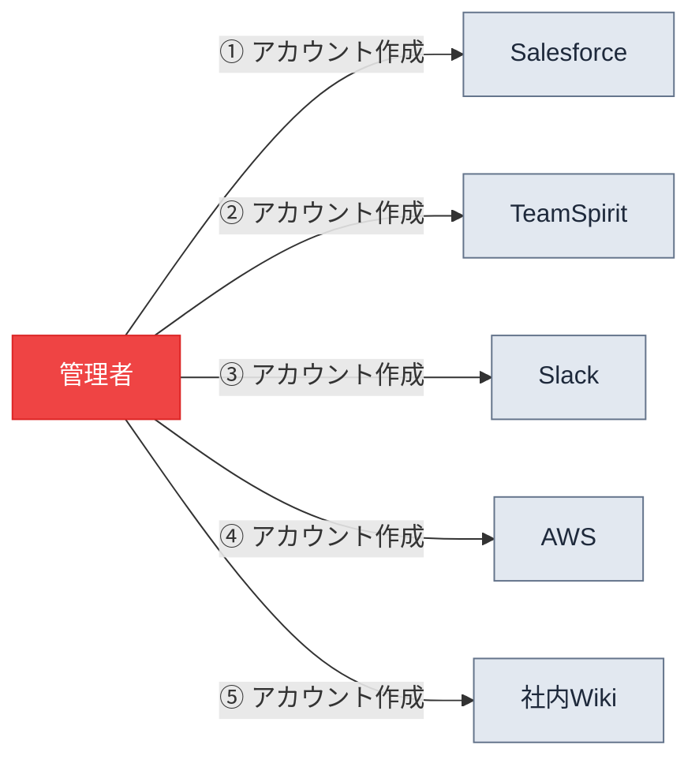
```mermaid
flowchart LR
    Admin["管理者"]

    Admin -->|"① アカウント作成"| SF["Salesforce"]
    Admin -->|"② アカウント作成"| TS["TeamSpirit"]
    Admin -->|"③ アカウント作成"| Slack["Slack"]
    Admin -->|"④ アカウント作成"| AWS["AWS"]
    Admin -->|"⑤ アカウント作成"| Wiki["社内Wiki"]

    style Admin fill:#ef4444,stroke:#dc2626,color:#fff
    style SF fill:#e2e8f0,stroke:#64748b,color:#1e293b
    style TS fill:#e2e8f0,stroke:#64748b,color:#1e293b
    style Slack fill:#e2e8f0,stroke:#64748b,color:#1e293b
    style AWS fill:#e2e8f0,stroke:#64748b,color:#1e293b
    style Wiki fill:#e2e8f0,stroke:#64748b,color:#1e293b
```

- 社員が入社するたびに、各システムに**個別にアカウントを作成**する必要がある
- 退職時は各システムを**手動で一つずつ無効化** → 漏れがあるとセキュリティ事故に
- ユーザーはシステムごとに**別々のID/パスワードを管理**する必要がある
- 「誰がどのシステムにアクセスできるか」の**全体像が見えない**

### ID管理がある世界

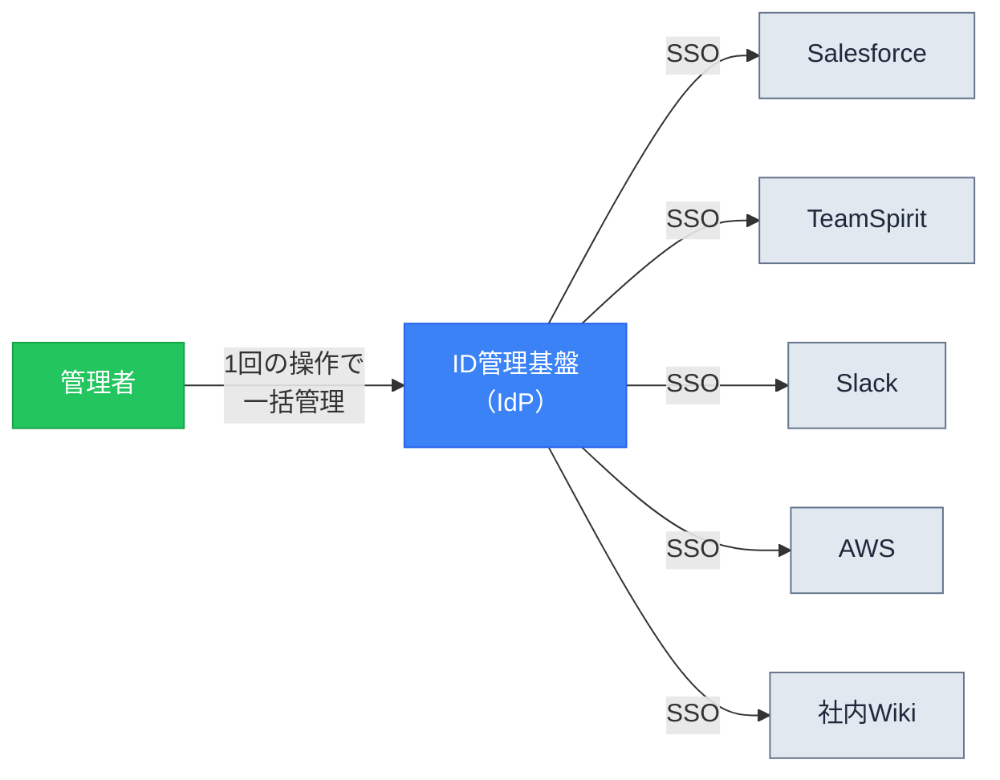
```mermaid
flowchart LR
    Admin["管理者"]
    IdP["ID管理基盤<br>（IdP）"]

    Admin -->|"1回の操作で<br>一括管理"| IdP
    IdP -->|"SSO"| SF["Salesforce"]
    IdP -->|"SSO"| TS["TeamSpirit"]
    IdP -->|"SSO"| Slack["Slack"]
    IdP -->|"SSO"| AWS["AWS"]
    IdP -->|"SSO"| Wiki["社内Wiki"]

    style Admin fill:#22c55e,stroke:#16a34a,color:#fff
    style IdP fill:#3b82f6,stroke:#2563eb,color:#fff
    style SF fill:#e2e8f0,stroke:#64748b,color:#1e293b
    style TS fill:#e2e8f0,stroke:#64748b,color:#1e293b
    style Slack fill:#e2e8f0,stroke:#64748b,color:#1e293b
    style AWS fill:#e2e8f0,stroke:#64748b,color:#1e293b
    style Wiki fill:#e2e8f0,stroke:#64748b,color:#1e293b
```

- 管理者は **IdP の1アカウントを管理するだけ** で全システムに反映
- 退職時は **1操作で全システムのアクセスを即時遮断**
- ユーザーは **1回のログインで全システムを利用可能**（SSO）
- 「誰が何にアクセスできるか」を **一覧で把握** できる

---

## 3. ID管理の5つの機能層

ID管理は以下の5つの層で構成されます。

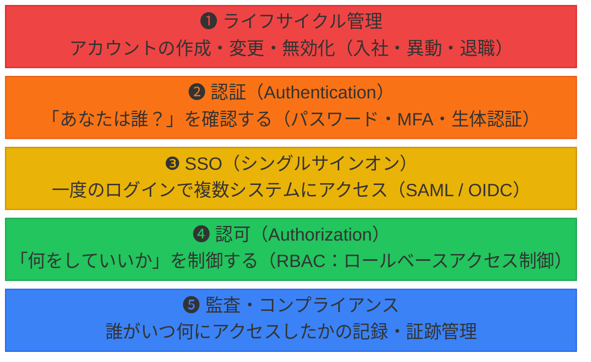
```mermaid
block-beta
    columns 1
    A["❶ ライフサイクル管理<br>アカウントの作成・変更・無効化（入社・異動・退職）"]
    B["❷ 認証（Authentication）<br>「あなたは誰？」を確認する（パスワード・MFA・生体認証）"]
    C["❸ SSO（シングルサインオン）<br>一度のログインで複数システムにアクセス（SAML / OIDC）"]
    D["❹ 認可（Authorization）<br>「何をしていいか」を制御する（RBAC：ロールベースアクセス制御）"]
    E["❺ 監査・コンプライアンス<br>誰がいつ何にアクセスしたかの記録・証跡管理"]

    style A fill:#ef4444,stroke:#dc2626,color:#fff
    style B fill:#f97316,stroke:#ea580c,color:#fff
    style C fill:#eab308,stroke:#ca8a04,color:#fff
    style D fill:#22c55e,stroke:#16a34a,color:#fff
    style E fill:#3b82f6,stroke:#2563eb,color:#fff
```

### 各層の詳細

| 層 | 名称 | 説明 | 具体例 |
|---|---|---|---|
| ❶ | ライフサイクル管理 | 人の出入りに連動してアカウントを管理 | 入社→アカウント作成、異動→権限変更、退職→無効化 |
| ❷ | 認証 | 本人確認 | パスワード、多要素認証（MFA）、生体認証 |
| ❸ | SSO | 一度の認証で複数システムを利用 | SAML 2.0 / OpenID Connect による連携 |
| ❹ | 認可 | アクセス可能な範囲を制御 | 「営業部 → Salesforce利用可」「一般社員 → 管理画面アクセス不可」 |
| ❺ | 監査 | アクセス履歴と権限変更の記録 | ログイン履歴、権限変更ログ、ISMS対応の証跡 |

### 特に重要な2つの層

**❶ ライフサイクル管理** は最も泥臭く、かつ最も重要です。「異動したのにアクセス権が前の部署のまま」「退職したのにアカウントが残っている」という問題は現実に頻発しており、これを自動化・一元管理することがID管理の核心的な価値です。

**❺ 監査** は企業規模が大きくなるほど必須になります。セキュリティ監査やISMS対応で「誰がいつどこにアクセスしたか提示してください」と求められた際に、ログが一元管理されていないと対応できません。

---

## 4. Active Directory だけではなぜダメなのか？

### AD が得意な領域

Active Directory（AD）は、Microsoftが提供するオンプレミス環境向けのID管理基盤です。以下の領域では非常に強力です。

- Windows PCのドメインログオン管理
- ファイルサーバーのアクセス制御
- Exchange（メール）との連携
- グループポリシーによる端末制御

**オンプレのWindowsベースのシステムだけで完結している会社であれば、ADだけで十分にカバーできます。**

### AD だけでは辛くなるケース

近年はSaaS（クラウドサービス）の利用が急増しており、ADだけではカバーしきれない領域が生まれています。

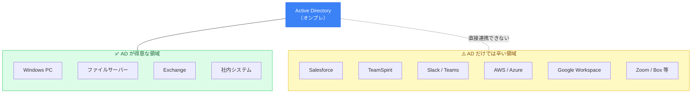
```mermaid
flowchart TB
    subgraph AD_OK["✅ AD が得意な領域"]
        direction TB
        PC["Windows PC"]
        FS["ファイルサーバー"]
        EX["Exchange"]
        OnPrem["社内システム"]
    end

    subgraph AD_NG["⚠️ AD だけでは辛い領域"]
        direction TB
        SF["Salesforce"]
        TS["TeamSpirit"]
        SlackS["Slack / Teams"]
        AWSS["AWS / Azure"]
        GWS["Google Workspace"]
        Zoom["Zoom / Box 等"]
    end

    AD["Active Directory<br>（オンプレ）"]
    AD --- AD_OK
    AD -. "直接連携できない" .- AD_NG

    style AD fill:#3b82f6,stroke:#2563eb,color:#fff
    style AD_OK fill:#dcfce7,stroke:#22c55e,color:#166534
    style AD_NG fill:#fef9c3,stroke:#eab308,color:#854d0e
```

SaaSとADを直接連携できないため、SaaSごとに個別のID/パスワード管理に逆戻りしてしまいます。

### 解決策：Azure AD（Entra ID）との連携

Microsoftはこの課題に対して、ADのクラウド拡張版である **Azure AD（現 Microsoft Entra ID）** を提供しています。

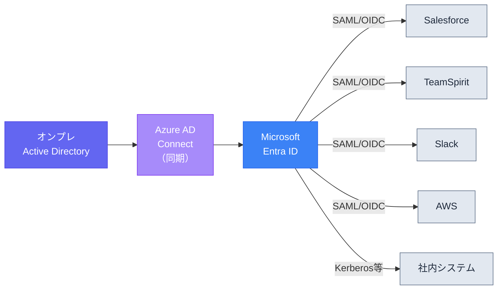
```mermaid
flowchart LR
    AD["オンプレ<br>Active Directory"]
    Connect["Azure AD<br>Connect<br>（同期）"]
    Entra["Microsoft<br>Entra ID"]

    AD --> Connect --> Entra

    Entra -->|"SAML/OIDC"| SF["Salesforce"]
    Entra -->|"SAML/OIDC"| TS["TeamSpirit"]
    Entra -->|"SAML/OIDC"| Slack["Slack"]
    Entra -->|"SAML/OIDC"| AWS["AWS"]
    Entra -->|"Kerberos等"| OnPrem["社内システム"]

    style AD fill:#6366f1,stroke:#4f46e5,color:#fff
    style Connect fill:#a78bfa,stroke:#7c3aed,color:#fff
    style Entra fill:#3b82f6,stroke:#2563eb,color:#fff
    style SF fill:#e2e8f0,stroke:#64748b,color:#1e293b
    style TS fill:#e2e8f0,stroke:#64748b,color:#1e293b
    style Slack fill:#e2e8f0,stroke:#64748b,color:#1e293b
    style AWS fill:#e2e8f0,stroke:#64748b,color:#1e293b
    style OnPrem fill:#e2e8f0,stroke:#64748b,color:#1e293b
```

この構成により、**オンプレADのアカウント情報を源泉としながら、クラウドサービスへのSSO連携** を実現できます。

---

## 5. 自前のID管理アプリが活きるケース

Entra ID + 各SaaSの標準SSO連携で済む会社であれば、自作は不要です。
自前のID管理アプリが価値を持つのは以下のようなケースです。

| ケース | 説明 |
|---|---|
| Entra ID のコストを抑えたい | Entra ID P1/P2 ライセンスはユーザー単価が高い。Keycloak（OSS）なら無料 |
| Entra ID に対応しない社内システムがある | 独自開発の社内アプリや古いシステムとの連携が必要 |
| 管理画面を自社運用に最適化したい | 権限一覧の可視化、承認フロー、独自のレポートなど |
| マルチIdP構成が必要 | AD + Google Workspace など複数の認証基盤を束ねたい |

### 自前構築の構成例（Keycloak ベース）

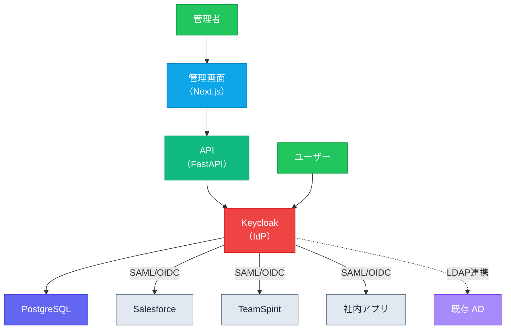
```mermaid
flowchart TB
    User["ユーザー"]
    Admin["管理者"]
    NextJS["管理画面<br>（Next.js）"]
    FastAPI["API<br>（FastAPI）"]
    KC["Keycloak<br>（IdP）"]
    DB["PostgreSQL"]

    Admin --> NextJS --> FastAPI --> KC
    User --> KC

    KC --> DB
    KC -->|"SAML/OIDC"| SF["Salesforce"]
    KC -->|"SAML/OIDC"| TS["TeamSpirit"]
    KC -->|"SAML/OIDC"| App["社内アプリ"]
    KC -.->|"LDAP連携"| AD["既存 AD"]

    style User fill:#22c55e,stroke:#16a34a,color:#fff
    style Admin fill:#22c55e,stroke:#16a34a,color:#fff
    style NextJS fill:#0ea5e9,stroke:#0284c7,color:#fff
    style FastAPI fill:#10b981,stroke:#059669,color:#fff
    style KC fill:#ef4444,stroke:#dc2626,color:#fff
    style DB fill:#6366f1,stroke:#4f46e5,color:#fff
    style SF fill:#e2e8f0,stroke:#64748b,color:#1e293b
    style TS fill:#e2e8f0,stroke:#64748b,color:#1e293b
    style App fill:#e2e8f0,stroke:#64748b,color:#1e293b
    style AD fill:#a78bfa,stroke:#7c3aed,color:#fff
```

この構成では、Keycloakが認証プロトコル（SAML/OIDC）の処理を担い、FastAPI + Next.js で独自の管理ダッシュボードを構築します。既存のADがある場合は、KeycloakのLDAP連携機能でユーザー情報を同期できます。

---

## 6. Keycloak とは

### 概要

Keycloak（キークローク）は、Red Hat社が開発を主導するオープンソースの **IAM（Identity and Access Management）** ソフトウェアです。2014年にバージョン1.0.0がリリースされ、Apacheライセンス 2.0で公開されています。

一言でいえば、**「アプリケーション開発者が認証・認可の仕組みを一から作らなくて済むようにする」** ためのソフトウェアです。Keycloakを導入すれば、SSO・多要素認証・ユーザー管理・アクセス制御といった機能を、コードをほとんど書かずに利用できます。

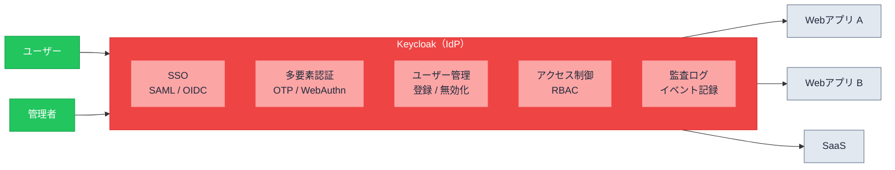
```mermaid
flowchart LR
    subgraph Keycloak["Keycloak（IdP）"]
        direction TB
        SSO["SSO<br>SAML / OIDC"]
        MFA["多要素認証<br>OTP / WebAuthn"]
        UM["ユーザー管理<br>登録 / 無効化"]
        RBAC["アクセス制御<br>RBAC"]
        Audit["監査ログ<br>イベント記録"]
    end

    User["ユーザー"] --> Keycloak
    Admin["管理者"] --> Keycloak

    Keycloak --> App1["Webアプリ A"]
    Keycloak --> App2["Webアプリ B"]
    Keycloak --> App3["SaaS"]

    style Keycloak fill:#ef4444,stroke:#dc2626,color:#fff
    style User fill:#22c55e,stroke:#16a34a,color:#fff
    style Admin fill:#22c55e,stroke:#16a34a,color:#fff
    style SSO fill:#fca5a5,stroke:#ef4444,color:#1e293b
    style MFA fill:#fca5a5,stroke:#ef4444,color:#1e293b
    style UM fill:#fca5a5,stroke:#ef4444,color:#1e293b
    style RBAC fill:#fca5a5,stroke:#ef4444,color:#1e293b
    style Audit fill:#fca5a5,stroke:#ef4444,color:#1e293b
    style App1 fill:#e2e8f0,stroke:#64748b,color:#1e293b
    style App2 fill:#e2e8f0,stroke:#64748b,color:#1e293b
    style App3 fill:#e2e8f0,stroke:#64748b,color:#1e293b
```

### 主な機能

| 機能 | 説明 |
|---|---|
| **シングルサインオン（SSO）** | SAML 2.0 / OpenID Connect / OAuth 2.0 に対応。一度の認証で複数のアプリケーションを利用可能 |
| **多要素認証（MFA）** | ワンタイムパスワード（OTP）、WebAuthn（生体認証・パスキー）に対応し、パスワードだけに頼らない認証を実現 |
| **ユーザー管理** | ユーザーの登録・プロファイル管理・グループ管理を管理コンソールから操作可能。ユーザー自身によるパスワードリセットやアカウント管理も可能 |
| **ロールベースアクセス制御（RBAC）** | ユーザーやグループにロールを割り当て、アプリケーションごとのアクセス権限をきめ細かく制御 |
| **外部IdP連携** | Active Directory / LDAP との連携に対応。既存のユーザーデータベースをそのまま活用可能 |
| **ソーシャルログイン** | Google、Facebook、GitHub 等のアカウントを使ったログインを管理コンソールの設定だけで実現 |
| **監査ログ** | ログインイベント（ログイン・ログアウト・パスワード変更等）と管理イベント（管理コンソール上の操作）を記録・閲覧可能 |
| **マルチテナント** | 「レルム」という単位で設定を分離でき、複数の組織やプロジェクトを1つのKeycloakインスタンスで管理可能 |
| **REST API** | すべての機能をREST API経由で操作可能。外部システムとの連携やカスタム管理画面の構築が容易 |

### なぜ Keycloak を選ぶのか

ID管理・SSO基盤の選択肢は他にもあります。Keycloakのポジションを整理すると以下のようになります。

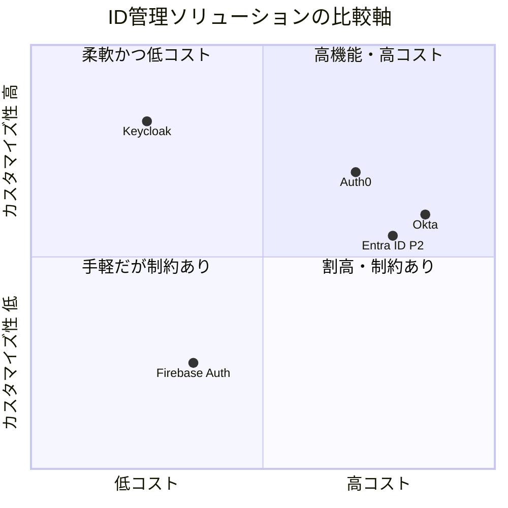
```mermaid
quadrantChart
    title ID管理ソリューションの比較軸
    x-axis "低コスト" --> "高コスト"
    y-axis "カスタマイズ性 低" --> "カスタマイズ性 高"
    quadrant-1 "高機能・高コスト"
    quadrant-2 "柔軟かつ低コスト"
    quadrant-3 "手軽だが制約あり"
    quadrant-4 "割高・制約あり"
    Keycloak: [0.25, 0.82]
    Entra ID P2: [0.78, 0.55]
    Okta: [0.85, 0.60]
    Auth0: [0.70, 0.70]
    Firebase Auth: [0.35, 0.25]
```

| ソリューション | 種別 | コスト | 特徴 |
|---|---|---|---|
| **Keycloak** | OSS / セルフホスト | 無料（インフラ費のみ） | 高いカスタマイズ性、REST APIで全機能操作可能、AD/LDAP連携が容易。運用は自前で行う必要がある |
| **Microsoft Entra ID** | クラウドサービス | P1: 約¥900/ユーザー/月、P2: 約¥1,350/ユーザー/月 | Microsoft製品との親和性が最高。条件付きアクセスや自動プロビジョニングなど高度な機能 |
| **Okta** | クラウドサービス | $2〜$15+/ユーザー/月 | エンタープライズ向けの定番。対応アプリが非常に多く、導入が容易 |
| **Auth0** | クラウドサービス | 無料枠あり、有料は$35/月〜 | 開発者フレンドリー。カスタマイズ性とクラウドの手軽さを両立 |

**Keycloakが特に適しているのは：**

- ライセンスコストを抑えたい（OSSなのでソフトウェア費用ゼロ）
- 管理画面やフローを自社業務に合わせてカスタマイズしたい
- Docker / Kubernetes 環境で柔軟にデプロイしたい
- REST APIを使って独自の管理ダッシュボードを構築したい（← 今回のプロトタイプ）
- 既存の AD / LDAP と連携しつつ、SaaS への SSO を追加したい

### Keycloak の動作環境

Keycloakは Java ベースのアプリケーションで、Docker コンテナとしてデプロイするのが最も一般的です。

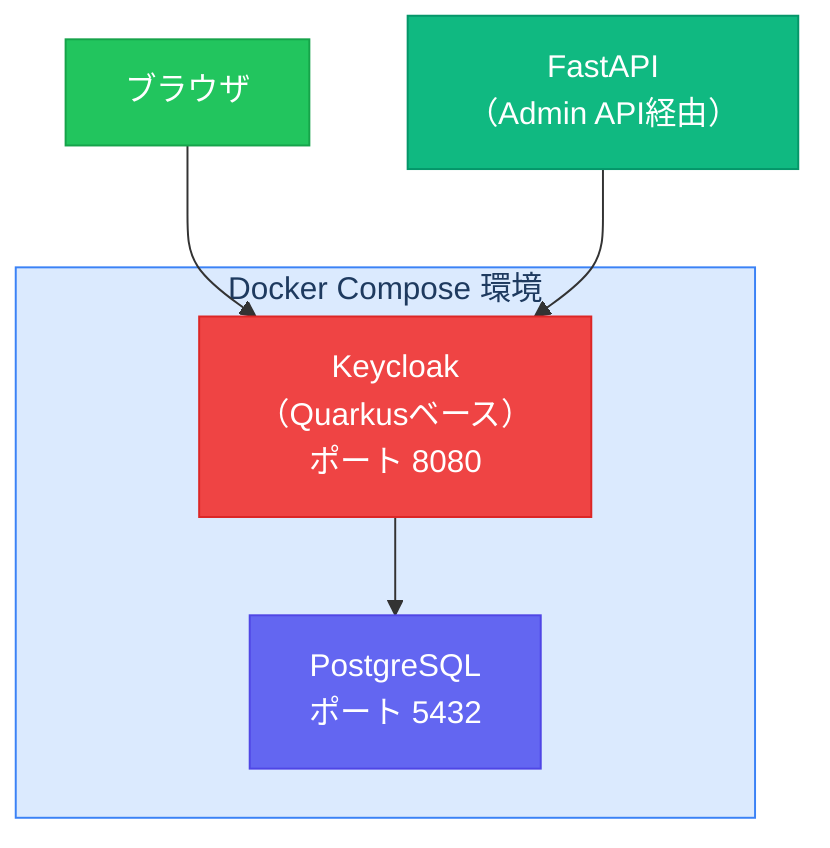
```mermaid
flowchart TB
    subgraph Docker["Docker Compose 環境"]
        KC["Keycloak<br>（Quarkusベース）<br>ポート 8080"]
        PG["PostgreSQL<br>ポート 5432"]
        KC --> PG
    end

    Browser["ブラウザ"] --> KC
    API["FastAPI<br>（Admin API経由）"] --> KC

    style Docker fill:#dbeafe,stroke:#3b82f6,color:#1e3a5f
    style KC fill:#ef4444,stroke:#dc2626,color:#fff
    style PG fill:#6366f1,stroke:#4f46e5,color:#fff
    style Browser fill:#22c55e,stroke:#16a34a,color:#fff
    style API fill:#10b981,stroke:#059669,color:#fff
```

- **Quarkusベース**: 2022年以降、WildFlyからQuarkusに基盤が移行され、起動速度とメモリ効率が向上
- **Docker公式イメージ**: `quay.io/keycloak/keycloak` で提供されており、`docker-compose` で簡単に構築可能
- **管理コンソール**: Keycloak自体にWebベースの管理画面が組み込まれており、ブラウザからユーザー・レルム・クライアント等を操作可能
- **最新バージョン**: v26系（2025〜2026年リリース）。MCP（Model Context Protocol）対応やワークフロー自動化機能などが追加されている

### Keycloak の基本概念 ― レルム・クライアント・ロール

Keycloakを使ううえで最初に理解すべき概念が **レルム（Realm）** です。

**レルムとは、Keycloak内の独立した管理空間（テナント）** のことです。1つのKeycloakサーバーの中に複数のレルムを作成でき、レルムごとにユーザー・ロール・SSO設定・認証ポリシーがすべて独立しています。


```mermaid
flowchart TB
    subgraph KC["Keycloak（1つのサーバー）"]
        direction TB
        subgraph Master["master レルム（管理用）"]
            MAdmin["スーパー管理者"]
        end

        subgraph RealmA["company-a レルム（A社用）"]
            direction TB
            UsersA["ユーザー:<br>田中, 佐藤, 鈴木"]
            RolesA["ロール:<br>admin, sales, hr"]
            ClientsA["SSO連携:<br>楽楽精算, Salesforce"]
            PolicyA["認証: パスワード＋MFA"]
        end

        subgraph RealmB["company-b レルム（B社用）"]
            direction TB
            UsersB["ユーザー:<br>山田, 高橋"]
            RolesB["ロール:<br>admin, engineer"]
            ClientsB["SSO連携:<br>Slack, AWS"]
            PolicyB["認証: パスワードのみ"]
        end
    end

    style KC fill:#fefce8,stroke:#eab308,color:#854d0e
    style Master fill:#fee2e2,stroke:#ef4444,color:#991b1b
    style RealmA fill:#dbeafe,stroke:#3b82f6,color:#1e3a5f
    style RealmB fill:#dcfce7,stroke:#22c55e,color:#166534
    style MAdmin fill:#fee2e2,stroke:#ef4444,color:#991b1b
    style UsersA fill:#dbeafe,stroke:#3b82f6,color:#1e3a5f
    style RolesA fill:#dbeafe,stroke:#3b82f6,color:#1e3a5f
    style ClientsA fill:#dbeafe,stroke:#3b82f6,color:#1e3a5f
    style PolicyA fill:#dbeafe,stroke:#3b82f6,color:#1e3a5f
    style UsersB fill:#dcfce7,stroke:#22c55e,color:#166534
    style RolesB fill:#dcfce7,stroke:#22c55e,color:#166534
    style ClientsB fill:#dcfce7,stroke:#22c55e,color:#166534
    style PolicyB fill:#dcfce7,stroke:#22c55e,color:#166534
```

A社のユーザーからはB社のユーザーやSSO設定は一切見えません。完全に独立した世界です。

**レルムの主な用途：**

| 用途 | 説明 | 例 |
|---|---|---|
| マルチテナント | 複数の会社を1つのKeycloakで管理 | SaaS提供者が顧客ごとにレルムを分ける |
| 環境分離 | 本番・検証・開発を安全に分離 | production レルムと staging レルム |
| 単一テナント | 自社専用として利用 | master以外に1つのレルムを作成 |

**master レルムは特別な存在** です。Keycloakをインストールすると最初から存在し、Keycloak全体を管理するスーパー管理者が所属します。実際のユーザーやSSO設定はmasterレルムには入れず、別のレルム（例: `demo`）を作成してそこに入れるのがベストプラクティスです。

**クライアント** とは、Keycloakにおける「SSO連携先のアプリケーション」の呼び名です。レルムの中にクライアントを登録することで、そのアプリへのSSO連携が有効になります。

**プロトタイプでのレルム構成：**

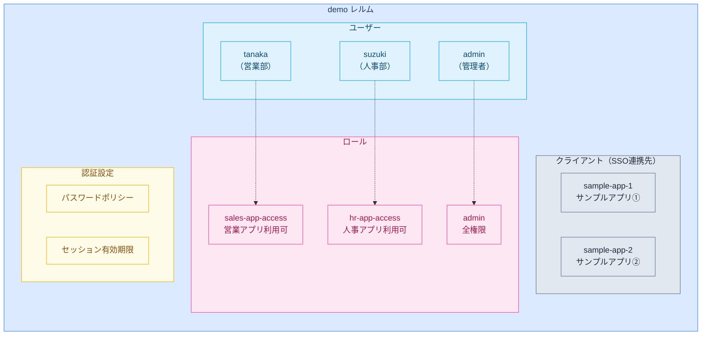
```mermaid
flowchart TB
    subgraph Demo["demo レルム"]
        direction TB
        subgraph Users["ユーザー"]
            U1["tanaka<br>（営業部）"]
            U2["suzuki<br>（人事部）"]
            U3["admin<br>（管理者）"]
        end

        subgraph Roles["ロール"]
            R1["sales-app-access<br>営業アプリ利用可"]
            R2["hr-app-access<br>人事アプリ利用可"]
            R3["admin<br>全権限"]
        end

        subgraph Clients["クライアント（SSO連携先）"]
            C1["sample-app-1<br>サンプルアプリ①"]
            C2["sample-app-2<br>サンプルアプリ②"]
        end

        subgraph Auth["認証設定"]
            A1["パスワードポリシー"]
            A2["セッション有効期限"]
        end
    end

    U1 -.-> R1
    U2 -.-> R2
    U3 -.-> R3

    style Demo fill:#dbeafe,stroke:#3b82f6,color:#1e3a5f
    style Users fill:#e0f2fe,stroke:#0ea5e9,color:#0c4a6e
    style Roles fill:#fce7f3,stroke:#ec4899,color:#9d174d
    style Clients fill:#e2e8f0,stroke:#64748b,color:#1e293b
    style Auth fill:#fefce8,stroke:#eab308,color:#854d0e
    style U1 fill:#e0f2fe,stroke:#0ea5e9,color:#0c4a6e
    style U2 fill:#e0f2fe,stroke:#0ea5e9,color:#0c4a6e
    style U3 fill:#e0f2fe,stroke:#0ea5e9,color:#0c4a6e
    style R1 fill:#fce7f3,stroke:#ec4899,color:#9d174d
    style R2 fill:#fce7f3,stroke:#ec4899,color:#9d174d
    style R3 fill:#fce7f3,stroke:#ec4899,color:#9d174d
    style C1 fill:#e2e8f0,stroke:#64748b,color:#1e293b
    style C2 fill:#e2e8f0,stroke:#64748b,color:#1e293b
    style A1 fill:#fefce8,stroke:#eab308,color:#854d0e
    style A2 fill:#fefce8,stroke:#eab308,color:#854d0e
```

デモでは、tanaka に `sales-app-access` ロールを付与して sample-app-1 にはログインできるが sample-app-2 にはアクセスできない、といった権限制御を見せることができます。

### Keycloak管理コンソール vs 自作アプリの使い分け

Keycloakには最初からWebベースの管理コンソールが備わっていますが、すべてをそこで行うわけではありません。**「何を管理するか」によって、管理コンソールと自作アプリを使い分ける**のが一般的です。

#### Keycloak管理コンソールで行うこと

**インフラ・基盤寄りの設定**は管理コンソールが主流です。これらは最初に一回設定したら頻繁に変更しないものです。

- レルムの作成・設定
- クライアント（SSO連携先アプリ）の登録・SAML/OIDC設定
- 認証フロー（MFA必須にするか等）の設定
- セッションポリシー（有効期限等）
- IdP連携（AD/LDAP連携の設定）
- ロールの定義

#### ユーザー管理のパターン

ユーザーの作成・削除・ロール付与といった日常的な操作は、**会社の規模と運用体制**によって3つのパターンに分かれます。


```mermaid
flowchart TB
    subgraph P1["パターン1: 管理コンソールをそのまま使う"]
        direction TB
        P1_Who["IT管理者が直接操作"]
        P1_Scale["小〜中規模向け"]
        P1_Pro["✅ 追加開発不要"]
        P1_Con["⚠️ 画面が複雑"]
    end

    subgraph P2["パターン2: 自作の管理画面"]
        direction TB
        P2_Who["人事・総務・部門管理者が操作"]
        P2_Scale["中〜大規模向け"]
        P2_Pro["✅ 業務に最適化した UI"]
        P2_Con["⚠️ 開発コストがかかる"]
    end

    subgraph P3["パターン3: 外部システム連携"]
        direction TB
        P3_Who["人事システムから自動連携"]
        P3_Scale["エンタープライズ向け"]
        P3_Pro["✅ 完全自動化"]
        P3_Con["⚠️ 構成が複雑"]
    end

    style P1 fill:#dbeafe,stroke:#3b82f6,color:#1e3a5f
    style P2 fill:#dcfce7,stroke:#22c55e,color:#166534
    style P3 fill:#fefce8,stroke:#eab308,color:#854d0e
    style P1_Who fill:#dbeafe,stroke:#3b82f6,color:#1e3a5f
    style P1_Scale fill:#dbeafe,stroke:#3b82f6,color:#1e3a5f
    style P1_Pro fill:#dbeafe,stroke:#3b82f6,color:#1e3a5f
    style P1_Con fill:#dbeafe,stroke:#3b82f6,color:#1e3a5f
    style P2_Who fill:#dcfce7,stroke:#22c55e,color:#166534
    style P2_Scale fill:#dcfce7,stroke:#22c55e,color:#166534
    style P2_Pro fill:#dcfce7,stroke:#22c55e,color:#166534
    style P2_Con fill:#dcfce7,stroke:#22c55e,color:#166534
    style P3_Who fill:#fefce8,stroke:#eab308,color:#854d0e
    style P3_Scale fill:#fefce8,stroke:#eab308,color:#854d0e
    style P3_Pro fill:#fefce8,stroke:#eab308,color:#854d0e
    style P3_Con fill:#fefce8,stroke:#eab308,color:#854d0e
```

**パターン1: Keycloak管理コンソールをそのまま使う（小〜中規模）**

Keycloakの管理コンソールにはユーザーの作成・削除・ロール付与・セッション管理が最初から備わっているので、IT管理者が直接操作する分にはこれで十分です。追加開発が不要なため、最もコストが低い選択肢です。

**パターン2: 自作の管理画面を作る（中〜大規模）** ← 今回のプロトタイプ

Keycloak Admin REST API を経由して、自社に最適化した管理画面を構築します。自作する主な理由は以下のとおりです。

- Keycloakの管理コンソールは **IT管理者向けで、画面が複雑すぎる** — 人事部門や総務部門が触るには敷居が高い
- **承認フローを入れたい** — 「上長が承認したらアカウント作成」のような業務フロー
- **権限の全体像を可視化したい** — 誰がどのシステムにアクセスできるかを一覧表示
- **監査ログをわかりやすく表示したい** — いつ誰が何をしたかをフィルタ・検索できるUI

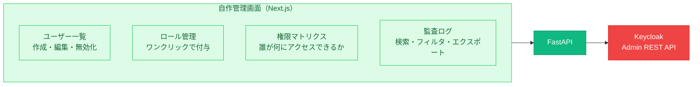
```mermaid
flowchart LR
    subgraph Custom["自作管理画面（Next.js）"]
        direction TB
        UL["ユーザー一覧<br>作成・編集・無効化"]
        RM["ロール管理<br>ワンクリックで付与"]
        Matrix["権限マトリクス<br>誰が何にアクセスできるか"]
        Log["監査ログ<br>検索・フィルタ・エクスポート"]
    end

    API["FastAPI"] --> KC_API["Keycloak<br>Admin REST API"]
    Custom --> API

    style Custom fill:#dcfce7,stroke:#22c55e,color:#166534
    style UL fill:#dcfce7,stroke:#22c55e,color:#166534
    style RM fill:#dcfce7,stroke:#22c55e,color:#166534
    style Matrix fill:#dcfce7,stroke:#22c55e,color:#166534
    style Log fill:#dcfce7,stroke:#22c55e,color:#166534
    style API fill:#10b981,stroke:#059669,color:#fff
    style KC_API fill:#ef4444,stroke:#dc2626,color:#fff
```

**パターン3: 外部システム連携（エンタープライズ）**

大企業では、人事システム（SAP、COMPANY等）と連携して「入社データが登録されたら自動でKeycloakにユーザー作成、退職したら自動削除」とする構成もあります。Keycloakの SCIM（System for Cross-domain Identity Management）対応やカスタムプロバイダーを使って実現します。

#### 機能別の比較

| 機能 | Keycloak管理コンソール | 自作アプリ（API経由） |
|---|---|---|
| 使う人 | IT管理者・エンジニア | 人事・総務・部門管理者 |
| レルム設定 | ✅ ここでやる | ─ |
| クライアント登録 | ✅ ここでやる | ─ |
| 認証フロー設定 | ✅ ここでやる | ─ |
| ユーザー作成・削除 | ✅ できる | ✅ こちらの方が使いやすい |
| ロール付与 | ✅ できる | ✅ こちらの方が使いやすい |
| 権限の一覧表示 | △ 見にくい | ✅ 自由にカスタマイズ可能 |
| 承認フロー | ❌ 機能なし | ✅ 自作で実装 |
| 監査ログ表示 | △ 見にくい | ✅ わかりやすく表示 |

#### デモでの見せ方

この使い分けは、**自作アプリの価値を見せる最大のポイント**です。

```
STEP 1: Keycloakの管理コンソールを見せる
  → 「Keycloakの標準管理画面でもユーザー管理はできますが…」
  → 画面が複雑で、ITに詳しくないと操作しにくいことを実感してもらう

STEP 2: 自作の管理画面を見せる
  → 「こちらが当社が開発した管理画面です」
  → ユーザー一覧、ロール付与、有効/無効切り替えがワンクリック
  → 権限マトリクス（誰がどのアプリにアクセスできるか）が一目瞭然
  → 「管理画面はお客様の運用に合わせてカスタマイズ可能です」
```

**「Keycloakを裏で使いつつ、管理画面は自社の運用に最適化する」** — これが今回のプロトタイプの核心的な訴求ポイントです。

### Keycloak のメリットとデメリット

Keycloakを提案する際は、メリットだけでなくデメリットも正直に伝えることで信頼につながります。ここでは両面を整理します。

#### メリット

**❶ ライセンスコストがゼロ**

Apache License 2.0のOSSなので、何ユーザー使ってもソフトウェア費用は無料です。

| ソリューション | 500人の会社で1年間の費用 |
|---|---|
| Entra ID P2（約¥1,350/ユーザー/月） | 約810万円 |
| Okta（$6/ユーザー/月 の場合） | 約540万円 |
| Keycloak | **¥0**（＋インフラ費 月1〜3万円程度） |

**❷ カスタマイズ性が圧倒的に高い**

OSSなのでソースコードにアクセスでき、あらゆる部分を自社に合わせて変えられます。ログイン画面のテーマ、認証フローの独自拡張、REST APIによる自作管理画面の構築、SPI（Service Provider Interface）による独自プロトコルの追加など、SaaS製品では不可能なレベルのカスタマイズが可能です。

**❸ 業界標準プロトコルを幅広くサポート**

SAML 2.0、OpenID Connect、OAuth 2.0 に加え、FAPI（金融グレードAPI）やWebAuthn（パスキー）にも対応しています。金融業界の厳しいセキュリティ要件にも使えるレベルです。

**❹ 既存のAD/LDAPとそのまま連携できる**

Keycloakの User Federation 機能でActive DirectoryやLDAPと直接連携可能です。既存のユーザーデータベースを捨てる必要がなく、Keycloakを「ADの前に立てる」形でSaaS連携を追加できます。

**❺ データを自社で完全にコントロールできる**

セルフホストなので、認証データ（ユーザー情報・ログイン履歴・セッション情報）がすべて自社管理下にあります。データ主権の確保、オンプレミス要件への対応、金融・医療・官公庁などデータの所在地が厳しく管理される業界での利用に適しています。

**❻ Docker / Kubernetes との親和性が高い**

Quarkusベースになってからコンテナ環境での運用が格段にやりやすくなりました。公式Dockerイメージで簡単に起動でき、Kubernetesへのデプロイもオペレーターが提供されています。水平スケーリングにも対応しています。

**❼ コミュニティと開発が活発**

Red Hatがバックについており、日立など日本企業もコアコントリビューターとして積極的に貢献しています。OSSのIdPとしては最もアクティブなプロジェクトの一つで、v26系ではMCP対応やワークフロー自動化機能が追加されるなど進化が続いています。

#### デメリット

**❶ インフラ運用は全部自分たちでやる必要がある**

最大のデメリットです。OktaやEntra IDのようなSaaSと違って、サーバーの構築・監視・障害対応、Keycloak自体のバージョンアップ、PostgreSQLのバックアップ・リストア、SSL証明書の管理、可用性の確保（冗長構成）など、すべて自前で対応する必要があります。

**❷ メジャーバージョンアップの互換性リスク**

特にWildFlyベースからQuarkusベースへの移行（v17→v20前後）は大きな破壊的変更でした。テーマやカスタムSPIを使っている場合、アップグレード時に動かなくなるリスクがあります。追従しないとセキュリティパッチが当たらず、追従すると壊れるかもしれないというジレンマがあります。

**❸ 商用サポートがない（標準では）**

問題が起きたときにベンダーに電話して助けてもらうことができません。対応策としてはRed Hatが提供する商用版「Red Hat build of Keycloak（RHBK）」を使うか、NRIのOpenStandiaなどOSSサポートサービスを契約する方法があります。

**❹ リスクベース認証・代理認証に非対応**

**リスクベース認証**（いつもと違う場所からのログイン時に追加認証を求める）や、**代理認証**（SAML/OIDC非対応のレガシーシステムに対してエージェントが代わりにログインする）には対応していません。OktaやEntra ID P2では標準機能です。

**❺ スケールすると運用が複雑化する**

SSO連携するクライアントやマルチテナントのレルムが増加すると、管理の複雑さが急激に増します。管理権限の委譲やTerraformによるコード管理など、運用設計を早めに整備する必要があります。

**❻ ID管理機能は単体では不十分**

Keycloakは本質的にはIdP（認証基盤）であり、ID管理ツールではありません。承認ワークフロー（上長承認後にアカウント作成）、人事システムとの自動連携（SCIMは実験的サポート）、未使用アカウントの自動検出（棚卸し）などは備わっていません。これを補完するのが今回の自作管理画面の役割です。

#### メリット・デメリットの全体比較

| 観点 | メリット | デメリット |
|---|---|---|
| コスト | ライセンス無料 | インフラ運用コストは自前 |
| カスタマイズ | あらゆる部分を変更可能 | カスタマイズには技術力が必要 |
| プロトコル対応 | SAML/OIDC/FAPI/WebAuthn | リスクベース認証・代理認証は非対応 |
| 既存環境との統合 | AD/LDAP連携が容易 | レガシーシステムとの連携は工夫が必要 |
| データ管理 | 完全に自社コントロール | バックアップ・DR設計も自前 |
| 運用 | 自由度が高い | 監視・アップグレードの責任を負う |
| サポート | コミュニティが活発 | 商用サポートは別途契約が必要 |
| スケーラビリティ | K8s対応・水平スケーリング可 | 大規模時はチューニングが必要 |
| ID管理機能 | REST APIで補完可能 | 単体ではワークフロー等が不足 |

#### 提案での伝え方

デメリットを隠さず、**「デメリットをどう補うか」をセットで提示する** のが信頼される提案の形です。

| デメリット | 補完策 |
|---|---|
| 運用が自前になる | 当社が運用支援・保守サポートを提供 |
| ID管理機能が不足 | 自作の管理画面で補完（今回のデモ） |
| リスクベース認証がない | KeycloakのSPIで拡張、またはWAF等で補完する構成を提案 |
| バージョンアップの互換性リスク | Docker構成でステージング環境を用意し、事前検証してから本番適用 |
| 商用サポートがない | RHBK導入やOSSサポートサービス契約を選択肢として提示 |

---

## 7. 国内SaaSとのSSO連携（楽楽シリーズの例）

ID管理基盤を導入する際、実際に社内で使っているSaaSとSSO連携できるかが重要です。ここでは国内で広く利用されている「楽楽シリーズ」を例に、連携の可否と仕組みを整理します。

### 楽楽精算のSSO対応状況

楽楽精算は **SAML 2.0 に対応した SP（Service Provider）** です。管理画面（管理 > システム設定 > セキュリティ）から「シングルサインオン設定」を有効化することで、外部のIdPと連携できます。

以下のIdPとの連携実績が確認されています。

| IdP | 連携方式 | 備考 |
|---|---|---|
| Microsoft Entra ID（旧 Azure AD） | SAML 2.0 | Entra IDのエンタープライズアプリギャラリーに楽楽精算が登録済み |
| GMOトラスト・ログイン | SAML 2.0 | 2022年11月にSAML認証連携を開始 |
| CloudGate UNO | SAML 2.0 | SAML 2.0のIdP情報を設定して連携 |
| メタップスクラウド | SAML 2.0 | SAML設定の登録で連携 |
| **Keycloak** | **SAML 2.0** | **SAML 2.0対応IdPであれば連携可能なため、Keycloakからも接続可能** |

### 楽楽シリーズ全体のSSO対応

楽楽精算だけでなく、楽楽シリーズの主要製品はいずれもSAML認証に対応しています。

| サービス | SSO対応 | 用途 |
|---|---|---|
| 楽楽精算 | SAML 2.0 ✅ | 経費精算 |
| 楽楽明細 | SAML 2.0 ✅ | 請求書・納品書の電子発行 |
| 楽楽販売 | SAML 2.0 ✅ | 販売管理 |

1つのIdP（Keycloakなど）から楽楽シリーズ全体にSSOできるため、複数の楽楽製品を導入している企業にとっては管理の一元化メリットが大きくなります。

### SSO連携の仕組み（SAML 2.0 フロー）

楽楽精算とKeycloakをSSO連携した場合の認証フローは以下のとおりです。

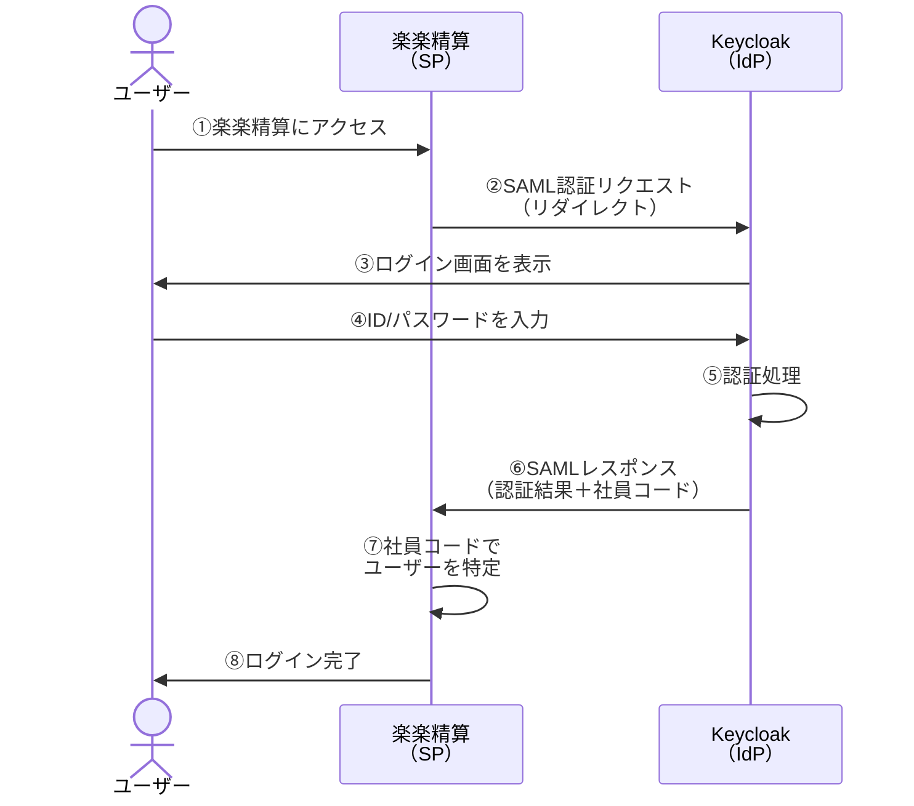
```mermaid
sequenceDiagram
    actor User as ユーザー
    participant RR as 楽楽精算<br>（SP）
    participant KC as Keycloak<br>（IdP）

    User->>RR: ①楽楽精算にアクセス
    RR->>KC: ②SAML認証リクエスト<br>（リダイレクト）
    KC->>User: ③ログイン画面を表示
    User->>KC: ④ID/パスワードを入力
    KC->>KC: ⑤認証処理
    KC->>RR: ⑥SAMLレスポンス<br>（認証結果＋社員コード）
    RR->>RR: ⑦社員コードで<br>ユーザーを特定
    RR->>User: ⑧ログイン完了
```

### 連携時の注意点

**ユーザー識別子の紐付けが必要**

楽楽精算はユーザーの識別に「社員コード」を使用します。Keycloak側のユーザー属性に社員コードを設定し、SAMLレスポンスの NameID またはカスタム属性として送信する必要があります。

```
Keycloak ユーザー属性             楽楽精算
─────────────────────────────────────────
employeeNumber: "EMP001"  →  社員コード: "EMP001"
（SAMLレスポンスで送信）
```

**設定中のロックアウトリスク**

楽楽精算側でSSO設定を有効化する際、設定を誤るとIdP経由でしかログインできなくなり、管理者がロックアウトされるリスクがあります。設定変更中は楽楽精算の管理画面を閉じないこと、また検証環境で事前にテストすることが重要です。

### 他の国内SaaSのSSO対応状況

楽楽シリーズ以外にも、多くの国内SaaSがSAML 2.0に対応しています。

| カテゴリ | サービス例 | SSO対応 |
|---|---|---|
| 勤怠管理 | TeamSpirit、KING OF TIME、ジョブカン | SAML 2.0 ✅ |
| グループウェア | サイボウズ Office/Garoon、Google Workspace | SAML 2.0 / OIDC ✅ |
| CRM/SFA | Salesforce、HubSpot | SAML 2.0 / OIDC ✅ |
| コミュニケーション | Slack、Microsoft Teams | SAML 2.0 / OIDC ✅ |
| ストレージ | Box、Google Drive、OneDrive | SAML 2.0 / OIDC ✅ |

SAML 2.0 は業界標準のプロトコルであるため、Keycloakを IdP として構築すれば、これらのサービスに対しても同様にSSO連携が可能です。

---

## 8. SSOの認証フロー ― 「一回ログインすれば全部使える」の仕組み

SSOの起点には **2つのパターン** があります。

### パターン1: IdP起点（IdP-Initiated SSO）

最初に **IdP（Keycloakなど）のポータル画面** にログインして、そこから各システムに飛ぶパターンです。Microsoft 365のアプリランチャー（ワッフルメニュー）と同じ体験です。

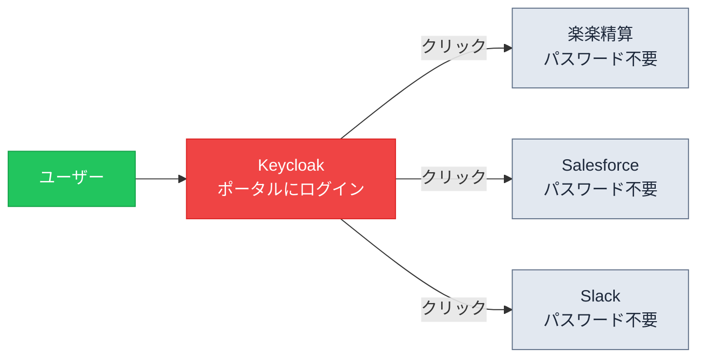
```mermaid
flowchart LR
    User["ユーザー"] --> KC["Keycloak<br>ポータルにログイン"]
    KC -->|"クリック"| RR["楽楽精算<br>パスワード不要"]
    KC -->|"クリック"| SF["Salesforce<br>パスワード不要"]
    KC -->|"クリック"| Slack["Slack<br>パスワード不要"]

    style User fill:#22c55e,stroke:#16a34a,color:#fff
    style KC fill:#ef4444,stroke:#dc2626,color:#fff
    style RR fill:#e2e8f0,stroke:#64748b,color:#1e293b
    style SF fill:#e2e8f0,stroke:#64748b,color:#1e293b
    style Slack fill:#e2e8f0,stroke:#64748b,color:#1e293b
```

### パターン2: SP起点（SP-Initiated SSO）

**各システムに直接アクセス** したときに、まだログインしていなければIdPに飛ばされるパターンです。実際にはこちらの方がより一般的です。

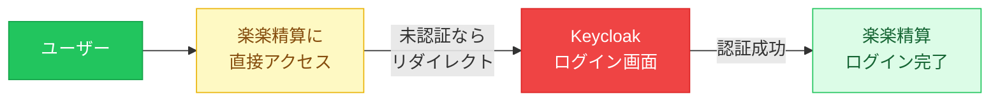
```mermaid
flowchart LR
    User["ユーザー"] --> RR["楽楽精算に<br>直接アクセス"]
    RR -->|"未認証なら<br>リダイレクト"| KC["Keycloak<br>ログイン画面"]
    KC -->|"認証成功"| RR2["楽楽精算<br>ログイン完了"]

    style User fill:#22c55e,stroke:#16a34a,color:#fff
    style RR fill:#fef9c3,stroke:#eab308,color:#854d0e
    style KC fill:#ef4444,stroke:#dc2626,color:#fff
    style RR2 fill:#dcfce7,stroke:#22c55e,color:#166534
```

### なぜ「一回で済む」のか ― セッションの仕組み

SSOの核心は、**IdP（Keycloak）側にセッション（ログイン状態）が保持される** ことです。一度Keycloakで認証が通ると、ブラウザにセッションCookieが保存されます。以降、別のシステムからKeycloakにリダイレクトされても、既にセッションが有効なのでログイン画面は表示されず、即座に認証が完了します。

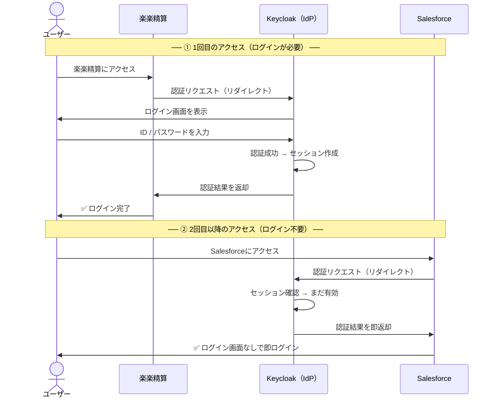
```mermaid
sequenceDiagram
    actor User as ユーザー
    participant RR as 楽楽精算
    participant KC as Keycloak（IdP）
    participant SF as Salesforce

    Note over User,SF: ── ① 1回目のアクセス（ログインが必要） ──
    User->>RR: 楽楽精算にアクセス
    RR->>KC: 認証リクエスト（リダイレクト）
    KC->>User: ログイン画面を表示
    User->>KC: ID / パスワードを入力
    KC->>KC: 認証成功 → セッション作成
    KC->>RR: 認証結果を返却
    RR->>User: ✅ ログイン完了

    Note over User,SF: ── ② 2回目以降のアクセス（ログイン不要） ──
    User->>SF: Salesforceにアクセス
    SF->>KC: 認証リクエスト（リダイレクト）
    KC->>KC: セッション確認 → まだ有効
    KC->>SF: 認証結果を即返却
    SF->>User: ✅ ログイン画面なしで即ログイン
```

### セッションのライフサイクル

セッションには有効期限があり、運用ポリシーに合わせて設定します。

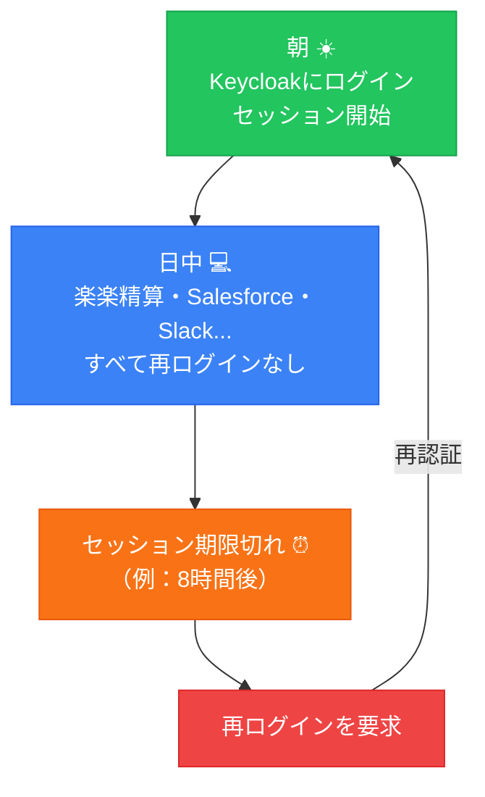
```mermaid
flowchart TB
    Login["朝 ☀️<br>Keycloakにログイン<br>セッション開始"]
    Active["日中 💻<br>楽楽精算・Salesforce・Slack...<br>すべて再ログインなし"]
    Expire["セッション期限切れ ⏰<br>（例：8時間後）"]
    Relogin["再ログインを要求"]

    Login --> Active --> Expire --> Relogin
    Relogin -->|"再認証"| Login

    style Login fill:#22c55e,stroke:#16a34a,color:#fff
    style Active fill:#3b82f6,stroke:#2563eb,color:#fff
    style Expire fill:#f97316,stroke:#ea580c,color:#fff
    style Relogin fill:#ef4444,stroke:#dc2626,color:#fff
```

| 設定項目 | 説明 | 一般的な設定例 |
|---|---|---|
| セッション有効期限 | アイドル状態でもセッションを維持する最大時間 | 8〜10時間（1営業日） |
| アイドルタイムアウト | 操作がない場合にセッションを切る時間 | 30分〜1時間 |
| リメンバーミー | ブラウザを閉じてもセッションを維持するか | 社内ポリシーによる |
| 強制再認証 | 機密性の高い操作時にパスワードを再要求 | 給与情報の閲覧時など |

Keycloakではこれらの設定をレルム単位で管理でき、管理コンソールから変更可能です。

### 実際の運用での組み合わせ

現実には **両方のパターンを組み合わせて運用** するのが一般的です。

| タイミング | パターン | 動作 |
|---|---|---|
| 朝の業務開始時 | IdP起点 | Keycloakのポータルにログインし、よく使うシステムにアクセス |
| 日中の業務中 | SP起点 | ブックマークやメールのリンクから各システムに直接アクセス → 再ログインなし |
| セッション期限切れ後 | SP起点 | アクセス時にKeycloakのログイン画面が再度表示される |
| 管理者によるアカウント無効化時 | ― | 次回アクセス時にログインが拒否される |

---

## 9. SSOの内部動作 ― リダイレクト・セッション・SAMLアサーション

セクション8ではSSOのユーザー体験を説明しました。ここでは「裏側で何が起きているか」を技術的に掘り下げます。

### SP起点SSOの詳細フロー（認証済みの場合）

2回目以降のアクセス（Keycloakで認証済みの場合）では、以下のことが裏側で起きています。

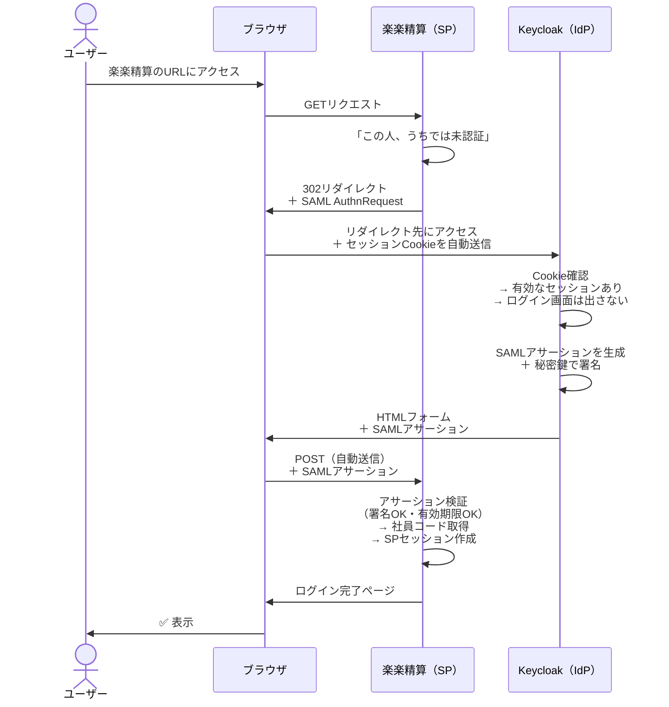
```mermaid
sequenceDiagram
    actor User as ユーザー
    participant Browser as ブラウザ
    participant RR as 楽楽精算（SP）
    participant KC as Keycloak（IdP）

    User->>Browser: 楽楽精算のURLにアクセス
    Browser->>RR: GETリクエスト
    RR->>RR: 「この人、うちでは未認証」
    RR->>Browser: 302リダイレクト<br>＋ SAML AuthnRequest
    Browser->>KC: リダイレクト先にアクセス<br>＋ セッションCookieを自動送信
    KC->>KC: Cookie確認<br>→ 有効なセッションあり<br>→ ログイン画面は出さない
    KC->>KC: SAMLアサーションを生成<br>＋ 秘密鍵で署名
    KC->>Browser: HTMLフォーム<br>＋ SAMLアサーション
    Browser->>RR: POST（自動送信）<br>＋ SAMLアサーション
    RR->>RR: アサーション検証<br>（署名OK・有効期限OK）<br>→ 社員コード取得<br>→ SPセッション作成
    RR->>Browser: ログイン完了ページ
    Browser->>User: ✅ 表示
```

ユーザーから見ると **一瞬ページが切り替わるだけ** で、リダイレクトが裏で往復しているのはほぼ気づきません。

### セッションが「2つ」存在する

SSOを正しく理解するうえで重要なのが、**IdP側のセッションとSP側のセッションは別物** だということです。

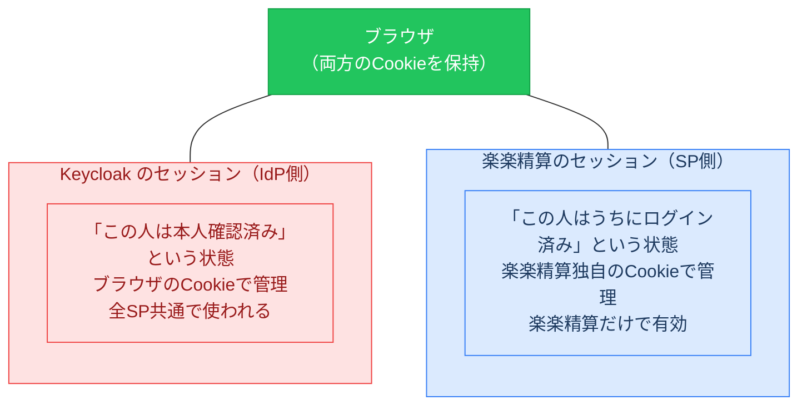
```mermaid
flowchart TB
    subgraph IdP_Session["Keycloak のセッション（IdP側）"]
        direction TB
        IdP_Desc["「この人は本人確認済み」という状態<br>ブラウザのCookieで管理<br>全SP共通で使われる"]
    end

    subgraph SP_Session["楽楽精算のセッション（SP側）"]
        direction TB
        SP_Desc["「この人はうちにログイン済み」という状態<br>楽楽精算独自のCookieで管理<br>楽楽精算だけで有効"]
    end

    Browser["ブラウザ<br>（両方のCookieを保持）"]
    Browser --- IdP_Session
    Browser --- SP_Session

    style IdP_Session fill:#fee2e2,stroke:#ef4444,color:#991b1b
    style SP_Session fill:#dbeafe,stroke:#3b82f6,color:#1e3a5f
    style Browser fill:#22c55e,stroke:#16a34a,color:#fff
    style IdP_Desc fill:#fee2e2,stroke:#ef4444,color:#991b1b
    style SP_Desc fill:#dbeafe,stroke:#3b82f6,color:#1e3a5f
```

この **2つのセッションの組み合わせ** によって、ユーザーの体験が変わります。

| Keycloakセッション | SPセッション | ユーザーの体験 |
|---|---|---|
| ✅ 有効 | ✅ 有効 | そのままシステムを利用できる（リダイレクトも発生しない） |
| ✅ 有効 | ❌ 切れた | リダイレクトは走るが、Keycloakが即SAMLアサーションを返すので **一瞬で再ログイン**（パスワード入力なし） |
| ❌ 切れた | ✅ 有効 | SPのセッションが残っている間はそのまま利用可能 |
| ❌ 切れた | ❌ 切れた | Keycloakのログイン画面が表示され、**パスワードの再入力が必要** |

### SAMLアサーションの中身

Keycloakが生成してSPに返す「SAMLアサーション」は、XML形式の認証証明書のようなものです。主に以下の情報が含まれます。

```mermaid
flowchart TB
    subgraph Assertion["SAMLアサーション"]
        direction TB
        Issuer["発行者（Issuer）<br>https://keycloak.example.com/realms/demo"]
        Subject["対象ユーザー（Subject）<br>NameID: EMP001（社員コード）"]
        Conditions["有効条件（Conditions）<br>有効期限: 数分間<br>対象SP: 楽楽精算のみ"]
        AuthnStmt["認証情報（AuthnStatement）<br>いつ・どうやって認証したか"]
        AttrStmt["属性情報（AttributeStatement）<br>email: user@example.com<br>role: sales<br>department: 営業部"]
        Signature["電子署名（Signature）<br>Keycloakの秘密鍵で署名<br>→ 改ざん防止"]
    end

    style Assertion fill:#fefce8,stroke:#eab308,color:#854d0e
    style Issuer fill:#e2e8f0,stroke:#64748b,color:#1e293b
    style Subject fill:#e2e8f0,stroke:#64748b,color:#1e293b
    style Conditions fill:#e2e8f0,stroke:#64748b,color:#1e293b
    style AuthnStmt fill:#e2e8f0,stroke:#64748b,color:#1e293b
    style AttrStmt fill:#e2e8f0,stroke:#64748b,color:#1e293b
    style Signature fill:#fee2e2,stroke:#ef4444,color:#991b1b
```

実際のXMLは以下のような構造です（簡略化）。

```xml
<saml:Assertion>
  <!-- 発行者: どのIdPが発行したか -->
  <saml:Issuer>https://keycloak.example.com/realms/demo</saml:Issuer>

  <!-- 対象ユーザー: 誰についてのアサーションか -->
  <saml:Subject>
    <saml:NameID>EMP001</saml:NameID>
  </saml:Subject>

  <!-- 有効条件: いつまで有効か、どのSP向けか -->
  <saml:Conditions NotBefore="2026-04-16T09:00:00Z"
                   NotOnOrAfter="2026-04-16T09:05:00Z">
    <saml:AudienceRestriction>
      <saml:Audience>https://rakurakuseisan.example.com</saml:Audience>
    </saml:AudienceRestriction>
  </saml:Conditions>

  <!-- 認証情報: いつ、どうやって認証したか -->
  <saml:AuthnStatement AuthnInstant="2026-04-16T08:55:00Z">
    <saml:AuthnContext>
      <saml:AuthnContextClassRef>
        urn:oasis:names:tc:SAML:2.0:ac:classes:PasswordProtectedTransport
      </saml:AuthnContextClassRef>
    </saml:AuthnContext>
  </saml:AuthnStatement>

  <!-- 属性情報: SPが必要とするユーザーデータ -->
  <saml:AttributeStatement>
    <saml:Attribute Name="email">
      <saml:AttributeValue>tanaka@example.com</saml:AttributeValue>
    </saml:Attribute>
    <saml:Attribute Name="role">
      <saml:AttributeValue>sales</saml:AttributeValue>
    </saml:Attribute>
    <saml:Attribute Name="department">
      <saml:AttributeValue>営業部</saml:AttributeValue>
    </saml:Attribute>
  </saml:AttributeStatement>

  <!-- 電子署名: Keycloakの秘密鍵で署名（改ざん防止） -->
  <ds:Signature>
    <!-- SP側はKeycloakの公開鍵で署名を検証する -->
  </ds:Signature>
</saml:Assertion>
```

### SP側の検証プロセス

楽楽精算（SP）がSAMLアサーションを受け取った後、以下の検証を行ってからログインを許可します。

```mermaid
flowchart TB
    Receive["SAMLアサーション受信"]
    Sig["① 署名検証<br>Keycloakの公開鍵で<br>電子署名を検証"]
    Time["② 有効期限チェック<br>NotBefore〜NotOnOrAfter<br>の範囲内か確認"]
    Audience["③ 宛先確認<br>Audienceが自分（楽楽精算）<br>宛てか確認"]
    User["④ ユーザー特定<br>NameID（社員コード）で<br>楽楽精算のユーザーを検索"]
    Session["⑤ セッション作成<br>楽楽精算側のセッションを発行"]
    Done["✅ ログイン完了"]
    Reject["❌ ログイン拒否"]

    Receive --> Sig
    Sig -->|"OK"| Time
    Sig -->|"NG"| Reject
    Time -->|"OK"| Audience
    Time -->|"期限切れ"| Reject
    Audience -->|"OK"| User
    Audience -->|"宛先不一致"| Reject
    User -->|"ユーザー発見"| Session
    User -->|"該当なし"| Reject
    Session --> Done

    style Receive fill:#3b82f6,stroke:#2563eb,color:#fff
    style Sig fill:#e2e8f0,stroke:#64748b,color:#1e293b
    style Time fill:#e2e8f0,stroke:#64748b,color:#1e293b
    style Audience fill:#e2e8f0,stroke:#64748b,color:#1e293b
    style User fill:#e2e8f0,stroke:#64748b,color:#1e293b
    style Session fill:#e2e8f0,stroke:#64748b,color:#1e293b
    style Done fill:#22c55e,stroke:#16a34a,color:#fff
    style Reject fill:#ef4444,stroke:#dc2626,color:#fff
```

この検証プロセスがあるため、**事前にIdPのメタデータ（公開鍵・証明書）をSP側に登録しておく必要がある** のです。楽楽精算の管理画面でKeycloakの証明書をアップロードするのは、まさにこの署名検証のためです。

---

## 10. まとめ

- **ID管理の本質** は「人の出入りとアクセス権を一箇所で安全に制御する」こと
- **5つの機能層**（ライフサイクル・認証・SSO・認可・監査）で構成される
- **AD** はオンプレWindows環境では強力だが、SaaS連携には **Entra ID** などクラウド側の仕組みが必要
- **自前構築** は、コスト削減・独自システム連携・管理画面カスタマイズなどのニーズがある場合に有効
- **Keycloak** はOSSのIdP基盤として、SSO・MFA・ユーザー管理・RBAC・監査ログを備え、REST APIで全機能を外部から操作可能。**レルム**（独立した管理空間）単位で設定を分離でき、マルチテナントや環境分離に対応
- **Keycloakの管理コンソール** は基盤設定（レルム・クライアント・認証フロー）に使い、**日常のユーザー管理は自作アプリ**（Admin REST API経由）で最適化するのが中〜大規模での主流
- **Keycloakのメリット** はライセンス無料・高いカスタマイズ性・データの自社管理。**デメリット** はインフラ運用の自前負担・リスクベース認証非対応・商用サポートなし。デメリットは運用支援や自作管理画面で補完可能
- **楽楽精算をはじめとする国内SaaS** の多くはSAML 2.0に対応しており、Keycloakからの SSO 連携が可能
- **SSOの体験** は「一度IdPにログインすればセッションが維持され、他のシステムにも再ログインなしでアクセスできる」こと。IdP起点・SP起点の2パターンがある
- **SSOの内部動作** では、IdP側とSP側で別々のセッションが存在し、SAMLアサーション（電子署名付きXML）によって認証情報が安全に受け渡される
- プロトタイプは **Keycloak + FastAPI + Next.js** の構成で実現可能
